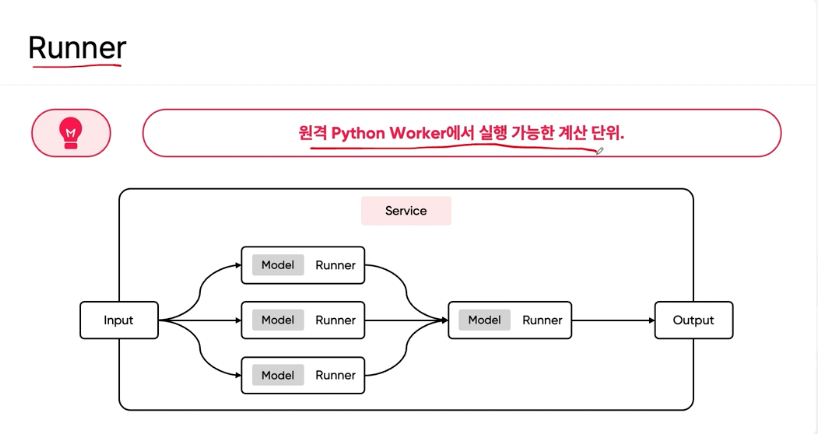

# BentoML 

BentoML은 머신러닝 모델을 쉽게 배포하고 운영할 수 있도록 도와주는 오픈 소스 플랫폼임. 

BentoML을 사용하면 모델을 다양한 환경에서 신속하게 배포할 수 있으며, 모델 관리, 추적 및 모니터링과 같은 기능도 제공합니다. 주요 특징은 다음과 같습니다:
- 모델 패키징: 다양한 프레임워크에서 학습된 모델을 표준화된 방식으로 패키징하여 재현성을 높이고, 다른 환경에 쉽게 배포할 수 있습니다.
- 서비스 생성: REST API 엔드포인트를 통해 모델을 쉽게 배포할 수 있으며, 모델 서비스 코드를 자동으로 생성합니다.
- 모델 저장소: 중앙 저장소를 통해 모델을 버전 관리하고 추적할 수 있습니다. 이는 모델의 변경 이력을 관리하는 데 유용합니다.
- 배포 옵션: 다양한 클라우드 플랫폼 및 온프레미스 환경에 배포할 수 있으며, Docker 컨테이너, Kubernetes, AWS Lambda 등과의 통합을 지원합니다.
- 모니터링 및 로깅: 모델의 성능을 모니터링하고, 로그 데이터를 수집하여 문제를 신속하게 파악하고 대응할 수 있습니다.


예시: BentoML 사용법 

1. 모델 저장 및 패키징: 

```python
# bentoml 라이브러리를 임포트하여 BentoML의 기능을 사용할 수 있도록 합니다. BentoML은 머신러닝 모델을 배포하고 관리하기 위한 오픈 소스 플랫폼입니다.
import bentoml

# bentoml.frameworks.sklearn 모듈에서 SklearnModelArtifact 클래스를 임포트합니다.
# SklearnModelArtifact 클래스: Scikit-learn으로 학습된 모델을 BentoML 아티팩트로 다루기 위해 사용되는 클래스입니다. 이 클래스는 모델을 패키징하고 저장할 때 필요한 메타데이터와 함께 모델을 저장할 수 있게 합니다.
# BentoML 아티팩트: 머신러닝 모델, 데이터 전처리기, 인퍼런스 로직 등 배포 시 필요한 구성 요소들을 일컫습니다. BentoML은 이러한 아티팩트를 패키징하고 관리하는 기능을 제공합니다.
from bentoml.frameworks.sklearn import SklearnModelArtifact

# 이 데코레이터는 클래스에 어떤 아티팩트(여기서는 Scikit-learn 모델)를 사용할지 지정합니다.
# 파이썬 데코레이터: 함수를 수정하거나 확장하는 특별한 문법입니다. 여기서는 클래스에 메타데이터를 추가하고, BentoML이 해당 클래스를 다룰 때 필요한 정보를 제공합니다.
# 'model'이라는 이름의 아티팩트를 지정하여, 이후에 이 이름을 통해 모델을 참조할 수 있게 합니다.
@bentoml.artifacts([SklearnModelArtifact('model')])

# 이 데코레이터는 환경 설정을 정의합니다.
# infer_pip_packages=True: BentoML이 서비스 실행에 필요한 Python 패키지를 자동으로 추론하고 설치합니다. 예를 들어, 사용된 라이브러리를 기반으로 필요한 패키지를 자동으로 감지하여 Docker 이미지나 다른 배포 환경에서 이를 설치하도록 합니다.
@bentoml.env(infer_pip_packages=True)

# IrisClassifier라는 클래스를 정의합니다. 이 클래스는 bentoml.BentoService를 상속받아 BentoML 서비스로 작동합니다.
# BentoML 서비스: BentoService를 상속받는 클래스는 BentoML이 제공하는 모델 배포 및 관리 기능을 사용할 수 있습니다. 즉, 모델을 API로 배포하거나, 저장소에 저장하고, 다른 환경으로 쉽게 이전할 수 있게 합니다.
class IrisClassifier(bentoml.BentoService):
    # 이 데코레이터는 predict 메서드를 API 엔드포인트로 정의합니다.
    # DataframeInput(): 입력 데이터를 데이터프레임 형태로 받도록 지정합니다. 이는 pandas 데이터프레임을 인풋으로 받을 때 유용합니다.
    # batch=True: 배치 처리를 허용하여, 여러 요청을 동시에 처리할 수 있게 합니다.
    @bentoml.api(input=DataframeInput(), batch=True)
    # predict 메서드를 정의합니다. 이 메서드는 입력 데이터프레임을 받아 예측을 수행합니다.
    # df는 입력 데이터로서, pandas 데이터프레임 형태를 가집니다.
    def predict(self, df):
        # self.artifacts.model은 이전에 정의된 SklearnModelArtifact('model')을 가리킵니다.
        # 예측 수행: 모델을 사용하여 입력 데이터프레임 df에 대한 예측을 수행하고, 그 결과를 반환합니다. Scikit-learn 모델의 predict 메서드를 호출합니다.
        return self.artifacts.model.predict(df)

# 학습된 모델을 저장
# IrisClassifier 클래스의 인스턴스를 생성하여 bento_service 변수에 할당합니다. 이 인스턴스는 모델 배포와 관련된 모든 기능을 사용할 수 있게 합니다.
bento_service = IrisClassifier()

# pack 메서드: 학습된 모델을 지정된 아티팩트('model')에 패키징합니다. 이 과정에서 모델은 메타데이터와 함께 저장되며, 나중에 로드하거나 배포할 수 있게 됩니다.
# trained_model은 이미 학습된 Scikit-learn 모델 객체를 가리킵니다.
bento_service.pack('model', trained_model)

# save 메서드: BentoML 서비스와 모델을 저장합니다. 저장된 서비스는 나중에 로드하거나 배포할 수 있습니다. 이 메서드는 저장된 경로를 반환하며, 이는 saved_path 변수에 할당됩니다.
saved_path = bento_service.save()
```

2. 모델 배포 
- BentoML을 사용하여 저장된 IrisClassifier 모델 서비스를 로컬에서 실행하는 명령어입니다. 이 명령어를 실행하면 API 서버가 시작되고, 이를 통해 모델을 호출하여 예측을 수행할 수 있습니다.
- bentoml: BentoML 명령줄 인터페이스(CLI) 도구입니다. BentoML의 다양한 기능을 명령줄에서 사용할 수 있도록 합니다.
- serve: BentoML 명령어 중 하나로, 지정된 모델 서비스를 로컬 서버에서 실행합니다. 이 서버는 HTTP API 엔드포인트를 제공하여 외부 요청을 처리합니다.
- IrisClassifier:latest: 실행할 모델 서비스의 이름과 버전을 지정합니다.
- 로컬 접근: 서버가 시작되면 로컬 호스트에서 해당 엔드포인트에 접근하여 모델 예측을 수행할 수 있습니다. 기본적으로 서버는 http://127.0.0.1:5000에서 실행됩니다.

```shell
bentoml serve IrisClassifier:latest
```

3. Docker 컨테이너로 배포
- `bentoml containerize IrisClassifier:latest` 명령은 BentoML을 사용하여 저장된 IrisClassifier 모델 서비스를 Docker 컨테이너로 패키징하는 명령어입니다

```shell
bentoml containerize IrisClassifier:latest
docker run -p 5000:5000 irisclassifier:latest
```

#### Q) TorchServe 와 BentoML 을 비교하자면?

TorchServe와 BentoML은 모두 머신러닝 모델을 배포하고 관리하는 데 사용되는 도구입니다. 


#### Q) BentoML 아티팩트는 좀 더 간단하게 배포할 수 있는거네? 입력 데이터를 전처리하고, 추론 로직을 작성해야하는 작업은 안해도 되고, model.preict() 메소드만 호출하면 되니까. 

맞습니다. 

BentoML이 제공하는 여러 기능 덕분에 입력 데이터의 전처리, 추론 로직 작성 등의 작업을 간소화할 수 있습니다

## BentoML 구조: 


- ML 프레임워크 (01):
  - 이 부분은 다양한 머신러닝 프레임워크를 나타냅니다. 예를 들어, PyTorch, TensorFlow, Transformers 등이 있습니다. BentoML은 이러한 프레임워크와 통합되어 모델을 다룰 수 있습니다.

- 모델 패키징 (02):
  - 이 부분은 모델을 패키징하고 API로 제공하는 역할을 합니다. 주요 구성 요소는 Runner와 API입니다.
    - Runner: 
      - 다양한 머신러닝 프레임워크에서 학습된 모델을 실행하고 추론을 수행하는 역할을 합니다. 즉, 실제로 모델이 예측 작업을 수행하는 엔진입니다.
      - Runner 는 실제 모델이 로컬이나 컨테이너로 패키징되서 배포되고 나서도 모델이 추론하도록 하는 엔진 역할을 하는거임.
      - 다양한 머신러닝 프레임워크의 모델을 실행할 수 있는 엔진 역할을 합니다. PyTorch, TensorFlow, Transformers 등에서 학습된 모델을 로드하고, 예측을 수행할 수 있습니다. 
      - 
    - API: 여러 API 엔드포인트를 정의하여 모델 서비스의 인터페이스를 제공합니다. 각 API는 특정 기능을 수행하며, 모델의 예측을 호출하는 역할을 합니다.

- 모델 서빙 (03):
  - 이 부분은 모델을 실제로 배포하고 서비스하는 단계를 나타냅니다. 주요 구성 요소는 Serve와 Containerize입니다.
    - Serve: 로컬 서버에서 모델을 배포하고 실행합니다. 이를 통해 REST API 엔드포인트를 통해 모델을 호출할 수 있습니다.
    - Containerize: 모델을 Docker 컨테이너로 패키징하여 다양한 환경에서 일관되게 배포할 수 있게 합니다. 이를 통해 클라우드나 온프레미스 환경에서 손쉽게 모델을 실행할 수 있습니다.


## Runner 구조 



Runner는 원격 Python Worker에서 실행 가능한 계산 단위로서, 다양한 작업을 분산 처리할 수 있는 기능을 제공합니다

Runner 는 하나의 모델과 연결되는 스레드 같은 거임. 이 단위로 요청을 처리해나간다. 

Runner는 로컬 환경뿐만 아니라 원격 Python Worker에서도 실행할 수 있다. 


#### Q) Python Worker 는 뭔데? 

Python Worker 는 자바로 치면 Excutors 와 유사하다. 

이 Workers 안에서 Runner 가 실행되는거임. 

#### Q) BentoML 을 이용해서 여러개의 모델과 Runner 를 이용해서 배포하는 방법의 예시는? 

```python
import bentoml
from bentoml.frameworks.sklearn import SklearnModelArtifact
from bentoml.adapters import DataframeInput
from sklearn.ensemble import RandomForestClassifier
from sklearn.linear_model import LogisticRegression
from sklearn.datasets import load_iris
from sklearn.model_selection import train_test_split

# 모델 학습
iris = load_iris()
X_train, X_test, y_train, y_test = train_test_split(iris.data, iris.target, test_size=0.2, random_state=42)

# 첫 번째 모델: RandomForestClassifier
model_rf = RandomForestClassifier()
model_rf.fit(X_train, y_train)

# 두 번째 모델: LogisticRegression
model_lr = LogisticRegression()
model_lr.fit(X_train, y_train)

# BentoService 정의
@bentoml.artifacts([SklearnModelArtifact('model_rf'), SklearnModelArtifact('model_lr')])
@bentoml.env(infer_pip_packages=True)
class MultiModelService(bentoml.BentoService):

    @bentoml.api(input=DataframeInput(), batch=True)
    def predict_rf(self, df):
        return self.artifacts.model_rf.predict(df)

    @bentoml.api(input=DataframeInput(), batch=True)
    def predict_lr(self, df):
        return self.artifacts.model_lr.predict(df)

# BentoService 인스턴스 생성 및 모델 패키징
bento_service = MultiModelService()
bento_service.pack('model_rf', model_rf)
bento_service.pack('model_lr', model_lr)

# BentoML 저장소에 서비스 저장
saved_path = bento_service.save()

# 모델 서빙: 로컬 서버에서 서비스 실행
!bentoml serve MultiModelService:latest

# 또는 Docker 컨테이너로 패키징 및 서빙
!bentoml containerize MultiModelService:latest
```

API 엔드포인트: 두 개의 별도 API 엔드포인트(predict_rf와 predict_lr)가 정의되어 있어, 각기 다른 모델을 호출할 수 있습니다.
- API 엔드포인트 주소
   - RandomForestClassifier 모델 예측 API:
     - URL: http://127.0.0.1:5000/predict_rf
     - HTTP 메서드: POST
     - 설명: 이 엔드포인트는 RandomForestClassifier 모델을 사용하여 예측을 수행합니다.
     
  - LogisticRegression 모델 예측 API:
    - URL: http://127.0.0.1:5000/predict_lr
    - HTTP 메서드: POST
    - 설명: 이 엔드포인트는 LogisticRegression 모델을 사용하여 예측을 수행합니다.

## BentoML 예시 

모델 학습 및 평가는 제외하고, 서빙부터 


```python
# 모델 저장.
# name 변수를 정의하고, 모델의 이름을 "bert_news_classification"으로 설정합니다. 이 이름은 모델을 저장하고 나중에 참조할 때 사용됩니다.
name = "bert_news_classification"

# bentoml.transformers.save_model 메서드를 사용하여 모델을 저장합니다.
# 첫 번째 인자는 모델의 이름입니다 (name 변수로 정의된 "bert_news_classification").
# 두 번째 인자는 pipeline 객체로, 여기서는 transformers 라이브러리의 pipeline 함수를 사용하여 텍스트 분류 파이프라인을 생성합니다. model과 tokenizer는 사전 학습된 BERT 모델과 토크나이저 객체입니다.
# pipeline 함수는 transformers 라이브러리의 핵심 기능 중 하나로, 다양한 NLP 작업을 간편하게 수행할 수 있도록 합니다.
# 이 코드가 실행되면, 해당 모델은 BentoML 저장소에 저장됩니다.
bentoml.transformers.save_model(
    name,
    pipeline("text-classification", model=model, tokenizer=tokenizer)
)

# %%shell 매직 명령어를 사용하여 셸 스크립트를 실행합니다. 이 스크립트는 service.py 파일을 생성합니다.
%%shell
# service.py

# cat 명령어를 사용하여 service.py 파일을 생성하고, 다음 EOF까지의 내용을 파일에 작성합니다.
cat > service.py <<EOF
import bentoml

# bentoml.models.get 메서드를 사용하여 최신 버전의 "bert_news_classification" 모델을 로드합니다.
# .to_runner() 메서드를 사용하여 모델을 Runner 객체로 변환합니다. Runner는 모델을 실행하고 추론을 수행하는 역할을 합니다.
runner = bentoml.models.get("bert_news_classification:latest").to_runner()

# bentoml.Service 클래스를 사용하여 새로운 서비스 객체를 생성합니다.
# name 인자는 서비스의 이름을 지정합니다.
# runners 인자는 이전에 생성된 Runner 객체의 리스트입니다. 여기서는 하나의 Runner를 포함하는 리스트를 전달합니다.
svc = bentoml.Service(
    name="bert_news_classification", runners=[runner]
)

# @svc.api 데코레이터를 사용하여 API 엔드포인트를 정의합니다.
# input=bentoml.io.Text()는 이 엔드포인트가 텍스트 입력을 받는다는 것을 나타냅니다.
# output=bentoml.io.JSON()는 이 엔드포인트가 JSON 형식으로 출력을 반환한다는 것을 나타냅니다.
@svc.api(input=bentoml.io.Text(), output=bentoml.io.JSON())

# classify라는 비동기 함수(코루틴)를 정의합니다. 이 함수는 텍스트 입력(text)을 받아 분류 결과를 반환합니다.
# 반환 타입은 dict[str, int|float]로, 결과는 문자열 키와 정수 또는 부동 소수점 값을 가지는 딕셔너리입니다.
async def classify(text: str) -> dict[str, int|float]:
    # runner.async_run 메서드를 호출하여 비동기적으로 모델 추론을 수행합니다. 입력 텍스트(text)와 최대 길이(max_length=512)를 인자로 전달합니다.
    # await 키워드를 사용하여 비동기 작업이 완료될 때까지 기다립니다.
    # output 변수에 추론 결과를 저장합니다.
    output = await runner.async_run(text, max_length=512)
    return output[0]
EOF

# %%script bash --bg 매직 명령어를 사용하여 백그라운드에서 셸 스크립트를 실행합니다.
%%script bash --bg

# bentoml serve service:svc 명령어를 사용하여 BentoML 서비스(svc)를 로컬 서버에서 실행합니다. 이 명령어가 실행되면, service.py 파일에 정의된 서비스가 HTTP 서버로 실행되고, API 엔드포인트를 통해 모델을 호출할 수 있게 됩니다.
bentoml serve service:svc
```

아래와 같이 뜨면 정상 실행.

```shell
# HTTP/1.1 200 OK
# date: Sat, DD MM YYYY HH:mm:ss GMT
# server: uvicorn
# content-length: 1
# content-type: text/plain; charset=utf-8

!curl -I -X GET localhost:3000/healthz
```

스포츠 기사 평가 (레이블: 1)
```shell
# 스포츠 기사 평가 (레이블: 1)
!curl -X "POST" \
   "http://0.0.0.0:3000/classify" \
   -H "accept: application/json" \
   -H "Content-Type: text/plain" \
   -d "Bleary-eyed from 16 hours on a Greyhound bus, he strolled into the stadium running on fumes. He’d barely slept in two days. The ride he was supposed to hitch from Charlotte to Indianapolis canceled at the last minute, and for a few nervy hours, Antonio Barnes started to have his doubts. The trip he’d waited 40 years for looked like it wasn’t going to happen.ADVERTISEMENTBut as he moved through the concourse at Lucas Oil Stadium an hour before the Colts faced the Raiders, it started to sink in. His pace quickened. His eyes widened. His voice picked up.“I got chills right now,” he said. “Chills.”Barnes, 57, is a lifer, a Colts fan since the Baltimore days. He wore No. 25 on his pee wee football team because that’s the number Nesby Glasgow wore on Sundays. He was a talent in his own right, too: one of his old coaches nicknamed him “Bird” because of his speed with the ball.Back then, he’d catch the city bus to Memorial Stadium, buy a bleacher ticket for $5 and watch Glasgow and Bert Jones, Curtis Dickey and Glenn Doughty. When he didn’t have any money, he’d find a hole in the fence and sneak in. After the game was over, he’d weasel his way onto the field and try to meet the players. “They were tall as trees,” he remembers.He remembers the last game he went to: Sept. 25, 1983, an overtime win over the Bears. Six months later the Colts would ditch Baltimore in the middle of the night, a sucker-punch some in the city never got over. But Barnes couldn’t quit them. When his entire family became Ravens fans, he refused. “The Colts are all I know,” he says.For years, when he couldn’t watch the games, he’d try the radio. And when that didn’t work, he’d follow the scroll at the bottom of a screen.“There were so many nights I’d just sit there in my cell, picturing what it’d be like to go to another game,” he says. “But you’re left with that thought that keeps running through your mind: I’m never getting out.”It’s hard to dream when you’re serving a life sentence for conspiracy to commit murder.It started with a handoff, a low-level dealer named Mickey Poole telling him to tuck a Ziploc full of heroin into his pocket and hide behind the Murphy towers. This was how young drug runners were groomed in Baltimore in the late 1970s. This was Barnes’ way in.ADVERTISEMENTHe was 12.Back then he idolized the Mickey Pooles of the world, the older kids who drove the shiny cars, wore the flashy jewelry, had the girls on their arms and made any working stiff punching a clock from 9 to 5 look like a fool. They owned the streets. Barnes wanted to own them, too.“In our world,” says his nephew Demon Brown, “the only successful people we saw were selling drugs and carrying guns.”So whenever Mickey would signal for a vial or two, Barnes would hurry over from his hiding spot with that Ziploc bag, out of breath because he’d been running so hard."
```

#### Q) 파이프라인 객체를 통해서 NLP 작업을 간단하게 할 수 있는건가? 파이프라인 객체를 안쓰고 모델을 이용해서 직접 예측하려면 추가적인 코드가 필요한거야? 

맞습니다. 

파이프라인 객체를 사용하면 NLP 작업을 간단하게 할 수 있습니다. Hugging Face의 pipeline 함수는 모델 로드, 토크나이징, 인퍼런스, 후처리 등의 작업을 자동으로 처리해 주기 때문에, 사용자가 직접 이러한 작업을 처리할 필요가 없습니다.


파이프라인을 사용한 객체:

```python
from transformers import pipeline

# 텍스트 분류 파이프라인을 생성합니다.
text_classification_pipeline = pipeline("text-classification", model="bert-base-uncased", tokenizer="bert-base-uncased")

# 예측할 텍스트
texts = ["I love this movie!", "This is a terrible movie."]

# 텍스트 분류 파이프라인을 사용하여 예측 수행
predictions = text_classification_pipeline(texts)

# 예측 결과 출력
for text, prediction in zip(texts, predictions):
    print(f"Text: {text}")
    print(f"Prediction: {prediction}")

```

파이프라인 객체 없이 직접 모델을 이용한 예측 예제

파이프라인 객체를 사용하지 않고 직접 모델을 이용하여 예측하려면 여러 단계를 거쳐야 합니다. 다음은 파이프라인 객체를 사용하지 않고 직접 텍스트 분류 예측을 수행하는 예제입니다:
- 모델 및 토크나이저 로드
- 텍스트 토크나이징
- 모델 인퍼런스
- 결과 후처리

```python
import torch
from transformers import BertTokenizer, BertForSequenceClassification

# 모델과 토크나이저 로드
model_name = "bert-base-uncased"
tokenizer = BertTokenizer.from_pretrained(model_name)
model = BertForSequenceClassification.from_pretrained(model_name)

# 예측할 텍스트
texts = ["I love this movie!", "This is a terrible movie."]

# 텍스트 토크나이징
inputs = tokenizer(texts, return_tensors="pt", padding=True, truncation=True, max_length=512)

# 모델 인퍼런스
with torch.no_grad():
    outputs = model(**inputs)
    logits = outputs.logits

# 결과 후처리
predictions = torch.softmax(logits, dim=-1)
predicted_labels = torch.argmax(predictions, dim=-1)

# 레이블 이름 맵핑
label_names = model.config.id2label

# 예측 결과 출력
for text, predicted_label, prediction in zip(texts, predicted_labels, predictions):
    label_name = label_names[predicted_label.item()]
    confidence = prediction[predicted_label].item()
    print(f"Text: {text}")
    print(f"Prediction: {{'label': '{label_name}', 'score': {confidence}}}")
```