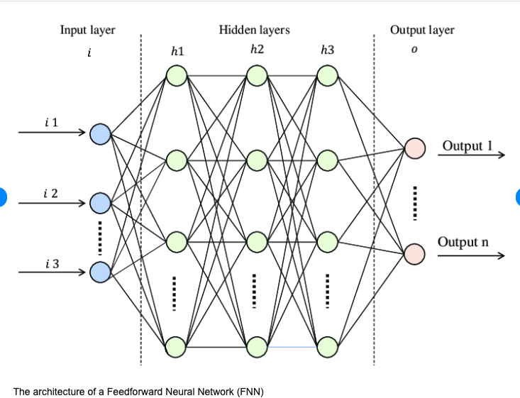
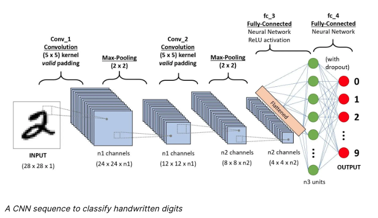
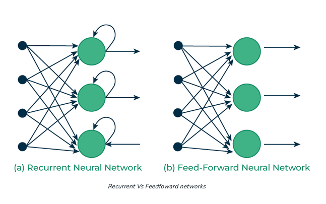

# Neural Network Architecture  

#### 순방향 신경망 (Feedforward Neural Network)

A Feedforward Neural Network (FNN) is a type of artificial neural network wherein connections between the nodes do not form a cycle.

This is one of the simplest forms of neural network architectures.

***

#### Q) What types of neural network architectures are there? Tell me about the characteristics and purpose of each architecture, when to use it, and how to use it.

Neural network architectures are designed to address specific types of problems, each with unique configurations and purposes. Here’s an overview of some prominent types:

Feedforward Neural Networks (FNN): 

- Characteristics:
  - Simplest type of artificial neural network.
  - Consists of an input layer, one or more hidden layers, and an output layer.
  - Neurons in each layer are connected to neurons in the next layer.
  - No cycles or loops.

- Purpose:
  - Used for tasks where data can be represented in a straightforward way, such as image classification or simple pattern recognition.

- When to Use:
  - When the problem is well-defined with a fixed-size input and output.
  - Suitable for tasks like regression and classification.
- How to Use:
  - Typically used with backpropagation for training.
  - Implemented using libraries like TensorFlow or PyTorch.

Convolutional Neural Networks (CNN):

- Characteristics:
  - Specialized for processing grid-like data such as images.
  - Includes convolutional layers, pooling layers, and fully connected layers.
  - Convolutional layers use filters to extract features.
- Purpose:
  - Primarily used for image and video recognition, classification, and segmentation.

- When to use: 
  - When dealing with spatial data (e.g., images).
  - Tasks like object detection, facial recognition, and medical image analysis.

- How to Use:
  - Design the architecture to include multiple convolutional and pooling layers.
  - Use frameworks like TensorFlow/Keras or PyTorch with pre-trained models like VGG, ResNet, etc.

Recurrent Neural Networks (RNN): 

- Characteristics:
  - Designed for sequential data. 
  - Contains loops that allow information to persist.
  - Can process sequences of varying length.
- Purpose:
  - Used for tasks involving sequential data like time series analysis, language modeling, and speech recognition.

- When to Use:
  - When dealing with time series data, natural language processing (NLP), or any sequential data.
  Tasks like machine translation, sentiment analysis, and stock price prediction.
- How to Use:
  - Utilize RNN layers, potentially with Long Short-Term Memory (LSTM) or Gated Recurrent Unit (GRU) cells for improved performance.
  - Libraries like TensorFlow/Keras and PyTorch support RNNs and their variants.

Long Short-Term Memory Networks (LSTM):

- Characteristics:
  - A type of RNN that can capture long-term dependencies.
  - Contains special units called memory cells that maintain information for long periods.

- Purpose:
  - Addresses the vanishing gradient problem in traditional RNNs, making it suitable for longer sequences.

- When to Use:
  - For sequential data where long-term context is important.
  - Tasks like language translation, music composition, and speech synthesis.

- How to Use:
  - Integrate LSTM layers into your neural network architecture.
  - Use deep learning frameworks like TensorFlow/Keras or PyTorch.

Autoencoders: 
- Characteristics:
  - Consists of an encoder and a decoder.
  - The encoder maps input to a lower-dimensional space; the decoder reconstructs the input.

- Purpose:
  - Used for unsupervised learning, particularly for dimensionality reduction, feature learning, and anomaly detection.

- When to Use:
  - When you need to reduce the dimensionality of data.
  - Tasks like image denoising, data compression, and anomaly detection.

- How to Use:
  - Design a symmetrical network with an encoder and decoder.
  - Train the model to minimize the reconstruction error.

Generative Adversarial Networks (GANs): 

- Characteristics:
  - Comprises two networks: a generator and a discriminator.
  - The generator creates fake data, and the discriminator distinguishes between real and fake data.

- Purpose:
  - Used for generating new, synthetic data similar to the training data.

- When to Use:
  - When you need to generate realistic data, such as images, text, or audio.
  - Tasks like image synthesis, style transfer, and data augmentation.

- How to Use:
  - Train the generator and discriminator in a min-max game setting.
  - Use frameworks like TensorFlow/Keras or PyTorch with libraries like GANLab.

Transformers
- Characteristics:
  - Based on self-attention mechanisms.
  - Can process entire sequences simultaneously rather than sequentially.

- Purpose:
  - Highly effective for NLP tasks and sequence-to-sequence problems.

- When to Use:
  - When dealing with language models, machine translation, or any task requiring context from the entire sequence.
  - Tasks like text generation, machine translation, and summarization.

- How to Use:
  - Implement using libraries that support transformers, such as Hugging Face Transformers.
  - Leverage pre-trained models like BERT, GPT, and T5.

***

#### Q) What are convolutional layers and pooling layers of CNNs 

So, convolutional layers are responsible for discovering patterns in input data, creating a feature map, and creating relationships between them, and Pooling Layers are responsible for simplifying and emphasizing these

***

#### Q) Long-term Dependency 문제는 RNN 에서 발생하는 문제야? 이게 뭔데? 

Yes.

the long-term dependency problem does occur in Recurrent Neural Networks (RNNs).

This issue arises when RNNs struggle to learn and retain information over long sequences, which is crucial for tasks requiring understanding of context over extended periods.

Recurrent Neural Networks (RNNs) are designed to handle sequential data by maintaining a hidden state that evolves as the network processes each element of the sequence. Ideally, RNNs can use this hidden state to capture dependencies between elements far apart in the sequence. However, in practice, this capability is often limited due to the long-term dependency problem.

***

#### Q) Why can the encoder + decoder structure in the autoencoder architecture be used for anomaly detection?

Steps in Anomaly Detection Using Autoencoders
- 1. Training on Normal Data:
  - The autoencoder is trained using only normal (non-anomalous) data. 
  - During training, the network learns to compress the input data into the latent space and then accurately reconstruct it.
- 2. Learning Normal Patterns:
  - The encoder learns the essential features and patterns of the normal data.
  - The decoder learns to use these features to reconstruct the input data with minimal error.

- 3. Reconstruction Error:
  - The difference between the input data and its reconstruction (reconstruction error) is typically small for normal data, as the autoencoder is well-trained on these patterns.

The mechanism of the autoencoder architecture is that the encoder reduces high-dimensional data to a low-dimensional level, extracts only the core of the data, and does the decoder have the ability to create it?

***

#### Q) When solving a problem that requires good prediction of minority classes using machine learning, unsupervised learning such as Autoencoder may be appropriate, right? If the pattern is a bit creative

Autoencoders can identify new, unseen anomalies because they focus on reconstructing the known normal patterns and flagging deviations.

Supervised learning can be quite effective for predicting minority classes if you have labeled data, even though the minority class is underrepresented. However, there are challenges and techniques to address them

***

#### Q) Is the GAN architecture a mechanism in which the generator generates data and the discriminator removes the generated data, thereby generating only real data?

No. 

The discriminator does not remove or discard data. Instead, it evaluates the generated data and provides feedback to the generator.

GAN Architecture
- Generator:
  - Purpose: The generator's goal is to create data that resembles the real data. 
  - Mechanism: It takes a random noise vector (often sampled from a Gaussian or uniform distribution) and transforms it through a neural network to produce synthetic data. 
  - Objective: To generate data that is indistinguishable from real data, fooling the discriminator.
  
- Discriminator:
  - Purpose: The discriminator's goal is to differentiate between real data (from the training set) and fake data (produced by the generator). 
  - Mechanism: It takes an input (either real or generated data) and passes it through a neural network to output a probability value indicating whether the input is real or fake.
  - Objective: To correctly identify real data as real and generated data as fake.

Training Process:
- The GAN training process is a two-player minimax game where the generator and discriminator are trained simultaneously:

- Discriminator Training:
  - Step: The discriminator is provided with a batch of real data and a batch of generated data.
  - Loss Calculation: It calculates the loss based on its ability to distinguish real data from fake data. This typically involves a binary cross-entropy loss where the discriminator aims to maximize the probability of correctly identifying real and fake data.
  - Update: The discriminator's parameters are updated to improve its accuracy.

- Generator Training:
  - Step: The generator produces a batch of synthetic data from random noise.
  - Loss Calculation: The generator's loss is calculated based on the discriminator's predictions. The goal is to minimize the discriminator's ability to identify the generated data as fake (i.e., maximize the probability that the discriminator is fooled).
  - Update: The generator's parameters are updated to produce more realistic data.

Iterative Process: 
- The generator and discriminator are trained in an iterative fashion, with each component improving in response to the other's improvements.
- Over time, the generator becomes better at producing realistic data, while the discriminator becomes better at distinguishing real data from fake data.
- The ultimate goal is for the generator to produce data that the discriminator cannot reliably distinguish from real data, meaning the generated data is highly realistic.

So the Generator learns to create fake data that looks like real, and the Discriminator learns to have the ability to distinguish between real and fake data 

***

#### Q) In the case of the difference between supervised learning and unsupervised learning, supervised learning is good at making predictions on data it has learned, but is unsupervised learning better at making predictions on data it has not experienced?

Making Predictions on Unseen Data
- Supervised Learning:
  - Better at Generalizing: If the training data is diverse and representative, supervised models can generalize well to new, similar data.
  - Struggles with Novel Patterns: They might not perform well on data that contains patterns significantly different from what they were trained on.

- Unsupervised Learning:
  - Flexibility: Unsupervised models can be more flexible in discovering new patterns and structures in completely unseen data because they are not constrained by predefined labels.
  - Not Directly Predictive: They do not provide direct predictions (e.g., classification labels or regression values) but can identify anomalies, group similar data points, or reduce data dimensionality, which can be useful for further analysis.
