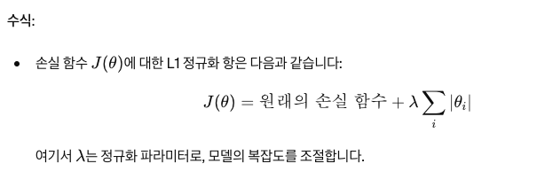
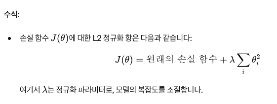

# Matrix Factorization 

Matrix Factorization은 주어진 행렬을 두 개 이상의 행렬로 분해하는 기법입니다

이 방법은 특히 추천 시스템에서 많이 사용되며, 예를 들어 사용자-아이템 평점 행렬을 기반으로 사용자가 선호할 아이템을 예측하는 데 활용됩니다

기본 개념을 설명하자면, 행렬 𝑅 을 두 개의 행렬 𝑃 와 𝑄 로 분해합니다. 𝑅 은 사용자와 아이템 간의 상호작용(예: 평점)을 나타내는 행렬입니다. 𝑃 는 사용자와 잠재 요인(latent factors) 간의 관계를 나타내는 행렬이고, 𝑄 는 아이템과 잠재 요인 간의 관계를 나타내는 행렬입니다. 이를 수식으로 표현하면 다음과 같습니다:

R ≈ P × Q

여기서 𝑃 와 𝑄 는 각각 𝑚 × 𝑘 와 𝑛 × 𝑘 크기의 행렬입니다. 𝑚 은 사용자 수, 𝑛 은 아이템 수, 𝑘 는 잠재 요인의 수를 나타냅니다.

적용 방법: 

- Matrix Factorization 은 초기에 P 와 Q 를 임의로 잡고 손실을 최소화 하는 방향으로 P 와 Q 를 갱신해나가는거임.  


예시: 
- 사용자 1과 아이템 2 간의 상호작용을 예측하는 경우:
  - 사용자 1에 대한 잠재 요인 벡터 𝑃1 를 가져옵니다.
  - 아이템 2에 대한 잠재 요인 벡터 𝑄2 를 가져옵니다.
  - 두 벡터의 내적을 계산하여 사용자 1이 아이템 2에 줄 평점을 예측합니다.

장점
- 추천 성능 향상: 많은 수의 사용자가 아이템에 대해 주는 평점을 효과적으로 예측할 수 있습니다.
- 잠재 요인 발견: 사용자와 아이템의 잠재적 특징을 발견할 수 있습니다.

단점
- 데이터 스파시티 문제: 사용자-아이템 평점 행렬이 매우 희소한 경우 예측 성능이 저하될 수 있습니다.
- 복잡성: 큰 데이터셋의 경우 계산 비용이 높아질 수 있습니다.

### Q) 잠재 요인이란? 

잠재 요인은 사용자가 선호하는 특성과 아이템의 특성을 내포하는 숨겨진 변수들입니다. 예를 들어, 영화 추천 시스템에서는 '액션의 정도', '로맨스의 정도', '코미디의 정도' 등의 특성이 잠재 요인이 될 수 있습니다.

사용자가 좋아하는 아이템의 속성 같은거임. 이게 숨겨져있다고 가정하고 k 를 잡는거고

역할: 
- 차원 축소: 𝑘 는 원래 사용자-아이템 평점 행렬의 차원을 줄여줍니다. 원래 행렬은 사용자 수와 아이템 수에 따라 매우 클 수 있지만, 잠재 요인을 이용하면 훨씬 작은 차원에서 데이터를 처리할 수 있습니다.
- 특징 표현: 각 사용자와 아이템은 𝑘 차원의 벡터로 표현됩니다. 사용자는 𝑘 개의 잠재 요인에 대한 선호도를 가지고 있고, 아이템은 𝑘 개의 잠재 요인을 포함합니다.
- 연산 효율성: 𝑘 가 크면 모델이 복잡해지고 계산량이 늘어나지만, 너무 작으면 충분히 정확한 예측을 하지 못할 수 있습니다. 적절한 𝑘 를 선택하는 것이 중요합니다.


### 예시 코드 

```python
# import pandas as pd: 데이터 분석과 조작을 위한 라이브러리인 pandas를 pd라는 별칭으로 불러옵니다.
import pandas as pd

# import numpy as np: 수치 계산을 위한 라이브러리인 NumPy를 np라는 별칭으로 불러옵니다.
import numpy as np

# from tqdm import tqdm: 코드 진행 상황을 보여주는 진행바 라이브러리인 tqdm에서 tqdm 함수를 불러옵니다.
from tqdm import tqdm

# from datasets import load_dataset: 다양한 데이터셋을 불러오기 위한 라이브러리에서 load_dataset 함수를 불러옵니다.
from datasets import load_dataset

# from sklearn.model_selection import train_test_split: Scikit-learn 라이브러리에서 데이터셋을 학습용과 테스트용으로 나누기 위한 train_test_split 함수를 불러옵니다.
from sklearn.model_selection import train_test_split

# import matplotlib.pyplot as plt: 데이터 시각화를 위한 라이브러리인 Matplotlib의 pyplot 모듈을 plt라는 별칭으로 불러옵니다.
import matplotlib.pyplot as plt

# data = load_dataset("nbtpj/movielens-1m-ratings")["train"].shuffle(seed=10).select(range(200000)): MovieLens 1M 데이터셋을 불러와서, train 부분을 가져오고, 이를 섞은 후, 처음 200,000개의 데이터를 선택합니다. 
# 여기서 shuffle(seed=10)은 데이터를 무작위로 섞되, 동일한 결과를 얻기 위해 시드를 10으로 설정합니다.
data = load_dataset("nbtpj/movielens-1m-ratings")["train"].shuffle(seed=10).select(range(200000))

# movielens_df = pd.DataFrame(data): 선택한 데이터를 pandas DataFrame으로 변환합니다.
movielens_df = pd.DataFrame(data)

# movielens_df = movielens_df[["user_id", "movie_id", "user_rating"]]: DataFrame에서 사용자 ID, 영화 ID, 사용자 평점 열만 선택하여 사용합니다.
movielens_df = movielens_df[["user_id", "movie_id", "user_rating"]]


# user_ids = movielens_df["user_id"].unique(): 사용자 ID의 고유값을 추출하여 user_ids 배열에 저장합니다.
user_ids = movielens_df["user_id"].unique()

# user_id_map = {id: index for index, id in enumerate(user_ids)}: 각 사용자 ID를 인덱스 값으로 매핑하는 딕셔너리를 생성합니다.
# 예를 들어, 사용자 ID가 123이면 0, 456이면 1로 매핑합니다.
user_id_map = {id: index for index, id in enumerate(user_ids)}

# movie_ids = movielens_df["movie_id"].unique(): 영화 ID의 고유값을 추출하여 movie_ids 배열에 저장합니다.
movie_ids = movielens_df["movie_id"].unique()

# movie_id_map = {id: index for index, id in enumerate(movie_ids)}: 각 영화 ID를 인덱스 값으로 매핑하는 딕셔너리를 생성합니다.
# 예를 들어, 영화 ID가 789이면 0, 1011이면 1로 매핑합니다.
movie_id_map = {id: index for index, id in enumerate(movie_ids)}

# movielens_df["user_id"] = movielens_df["user_id"].map(user_id_map): 원래의 사용자 ID를 인덱스 값으로 매핑하여 DataFrame의 user_id 열을 업데이트합니다.
movielens_df["user_id"] = movielens_df["user_id"].map(user_id_map)
movielens_df["movie_id"] = movielens_df["movie_id"].map(movie_id_map)

train_data, test_data = train_test_split(movielens_df, test_size=0.2, random_state=10)
```

### Q) 그래서 데이터가 어떻게 변경되는건데? 

1. data 단계

먼저, load_dataset으로 불러온 초기 데이터 data는 shuffle 및 select 과정을 거쳐 아래와 같은 형태로 나타납니다.

```python
# 예시 데이터
data = [
    {'user_id': 1, 'movie_id': 10, 'user_rating': 4.0},
    {'user_id': 2, 'movie_id': 15, 'user_rating': 5.0},
    {'user_id': 1, 'movie_id': 20, 'user_rating': 3.0},
    {'user_id': 3, 'movie_id': 10, 'user_rating': 2.0},
    {'user_id': 2, 'movie_id': 20, 'user_rating': 4.5},
]
```

2. movielens_df 단계

data를 DataFrame으로 변환하고 필요한 열만 선택한 후의 데이터는 다음과 같습니다.

```python
movielens_df = pd.DataFrame(data)
movielens_df = movielens_df[["user_id", "movie_id", "user_rating"]]

# 변환 후 데이터
movielens_df = pd.DataFrame([
    {'user_id': 1, 'movie_id': 10, 'user_rating': 4.0},
    {'user_id': 2, 'movie_id': 15, 'user_rating': 5.0},
    {'user_id': 1, 'movie_id': 20, 'user_rating': 3.0},
    {'user_id': 3, 'movie_id': 10, 'user_rating': 2.0},
    {'user_id': 2, 'movie_id': 20, 'user_rating': 4.5},
])
```

3. user_ids, movie_ids 단계

고유한 사용자 ID와 영화 ID를 추출한 결과는 다음과 같습니다.

```python
user_ids = movielens_df["user_id"].unique()
# user_ids: array([1, 2, 3])

movie_ids = movielens_df["movie_id"].unique()
# movie_ids: array([10, 15, 20])
```

4. user_id_map, movie_id_map 단계

사용자 ID와 영화 ID를 인덱스로 매핑한 딕셔너리는 다음과 같습니다.

```python
user_id_map = {id: index for index, id in enumerate(user_ids)}
# user_id_map: {1: 0, 2: 1, 3: 2}

movie_id_map = {id: index for index, id in enumerate(movie_ids)}
# movie_id_map: {10: 0, 15: 1, 20: 2}
```

5. movielens_df["user_id"], movielens_df["movie_id"] 단계

원래의 사용자 ID와 영화 ID를 인덱스로 매핑하여 DataFrame을 업데이트한 결과는 다음과 같습니다.

```python
movielens_df["user_id"] = movielens_df["user_id"].map(user_id_map)
movielens_df["movie_id"] = movielens_df["movie_id"].map(movie_id_map)

# 업데이트 후 데이터
movielens_df = pd.DataFrame([
    {'user_id': 0, 'movie_id': 0, 'user_rating': 4.0},
    {'user_id': 1, 'movie_id': 1, 'user_rating': 5.0},
    {'user_id': 0, 'movie_id': 2, 'user_rating': 3.0},
    {'user_id': 2, 'movie_id': 0, 'user_rating': 2.0},
    {'user_id': 1, 'movie_id': 2, 'user_rating': 4.5},
])
```

### Q) 이렇게 변경한 이유는 뭔데? 

Before: movielens_df 


After: movielens_df 


기존에 문자열로 표시되던 movie_id 와 user_id 를 정수형으로 변경시킨것. 

그리고 id 값을 0번부터의 인덱스로 매핑시켜서 작은 정수로 변환시켰다. 

이런 정수가 그래도 연속적이고 작은 값으로 있는게 행렬 분해 (Matrix Factorization) 에 유리하다. 


```python
# num_users = len(user_ids): user_ids의 길이를 계산하여 총 사용자 수를 num_users에 저장합니다.
num_users = len(user_ids)

# num_movies = len(movie_ids):movie_ids의 길이를 계산하여 총 영화 수를 num_movies에 저장합니다.
num_movies = len(movie_ids)

# 사용자와 영화의 특성 벡터의 차원을 10으로 설정합니다. 이는 사용자와 영화 각각의 잠재 요인의 수를 나타냅니다.
num_features = 10

# 평균 0, 표준편차 0.1의 정규분포를 따르는 임의의 값으로 사용자 특성 행렬을 초기화합니다. 크기는 (num_users, num_features)입니다.
user_features = np.random.normal(0, .1, (num_users, num_features))

# 평균 0, 표준편차 0.1의 정규분포를 따르는 임의의 값으로 영화 특성 행렬을 초기화합니다. 크기는 (num_movies, num_features)입니다.
movie_features = np.random.normal(0, .1, (num_movies, num_features))

# 학습률을 0.01로 설정합니다. 학습률은 각 업데이트 단계에서 얼마나 큰 폭으로 값을 조정할지 결정합니다.
learning_rate = 0.01

# 정규화 항을 0.1로 설정합니다. 이는 과적합을 방지하기 위해 특성 벡터의 크기를 줄이는 역할을 합니다.
regularization = 0.1

# 학습을 20번 반복할 것을 설정합니다.
epochs = 20

# 각 epoch에서 계산된 RMSE 값을 저장할 빈 리스트를 초기화합니다.
epoch_rmse: list[float] = []

# 주어진 user_id와 movie_id에 대해 예측 평점을 계산하는 함수를 정의합니다.
# 사용자의 특성 벡터와 영화의 특성 벡터 간의 내적을 계산하여 예측 평점을 반환합니다.
def predict_rating(user_id: int, movie_id: int) -> float:
    return np.dot(user_features[user_id], movie_features[movie_id])


# 총 epochs 횟수만큼 반복 학습을 수행합니다. tqdm은 진행 상황을 시각적으로 보여줍니다.
for epoch in tqdm(range(epochs)):
    # 각 epoch에서 제곱 오차를 저장할 빈 리스트를 초기화합니다.
    squared_errors: list[float] = []

    # 학습 데이터의 각 행을 반복합니다.
    for _, row in train_data.iterrows():
        # 현재 행에서 user_id를 가져와 정수형으로 변환합니다.
        user_id = int(row["user_id"])
        
        # 현재 행에서 movie_id를 가져와 정수형으로 변환합니다.
        movie_id = int(row["movie_id"])
        
        # 현재 행에서 실제 평점을 가져옵니다.
        rating = row["user_rating"]

        # 예측 평점을 계산합니다.
        prediction = predict_rating(user_id, movie_id)
        
        # 실제 평점과 예측 평점 간의 오차를 계산합니다.
        error = rating - prediction
        
        # 오차의 제곱을 리스트에 추가합니다. 
        squared_errors.append(error**2)

        # 이 코드는 경사 하강법을 이용해 사용자 특성 벡터 user_features[user_id]를 업데이트하는 부분입니다.
        # 사용자 특성 벡터를 업데이트합니다. 업데이트는 오차와 영화 특성 벡터에 비례하고, 정규화 항에 의해 조정됩니다.
        # user_features[user_id]와 movie_features[movie_id]는 각각 사용자와 영화의 특성 벡터입니다.
        # 특성 벡터를 업데이트하여 예측 평점이 실제 평점에 더 가깝도록 합니다.
        # 1. error * movie_features[movie_id]
        # 1. error * movie_features[movie_id]는 사용자의 특성 벡터를 얼마나 조정할지를 결정합니다.
        # 1. 예측 평점이 실제 평점보다 낮다면(error > 0), 사용자 특성 벡터를 더 높게 조정하고, 예측 평점이 실제 평점보다 높다면(error < 0), 사용자 특성 벡터를 낮게 조정합니다.
        # 1. error * movie_features[movie_id]를 곱함으로써, 영화의 특성 벡터가 예측 오차에 미치는 영향을 반영하여 사용자 특성 벡터를 조정합니다.
        # 
        # 2. regularization * user_features[user_id]
        # 정규화 (Regularization): 정규화 항은 과적합(overfitting)을 방지하기 위해 추가합니다.
        # regularization * user_features[user_id]는 사용자 특성 벡터의 크기를 줄이는 역할을 합니다.
        # 이는 사용자  특성 벡터가 너무 커지는 것을 방지하여 모델의 일반화 성능을 높입니다.
        # 
        # 3. 전체 업데이트 공식
        # learning_rate는 각 업데이트 단계에서 매개변수 조정의 크기를 결정합니다.
        # 사용자 특성 벡터 user_features[user_id]는 learning_rate만큼 error * movie_features[movie_id]에 의해 조정됩니다.
        # 정규화 항 regularization * user_features[user_id]를 빼는 이유는 벡터의 크기를 일정하게 유지하여 과적합을 방지하기 위함입니다. 
        user_features[user_id] += learning_rate * (error * movie_features[movie_id] - regularization * user_features[user_id])
        
        # 영화 특성 벡터를 업데이트합니다. 업데이트는 오차와 사용자 특성 벡터에 비례하고, 정규화 항에 의해 조정됩니다.
        movie_features[movie_id] += learning_rate * (error * user_features[user_id] - regularization * movie_features[movie_id])

    # 각 epoch의 RMSE를 계산하여 리스트에 추가합니다. RMSE는 제곱 오차의 평균에 루트를 씌운 값입니다.
    epoch_rmse.append(np.sqrt(np.mean(squared_errors)))
```


```python
plt.figure(figsize=(10, 5))
plt.plot(range(1, epochs+1), epoch_rmse, linewidth=2, color="#fc1c49")
plt.title("Epoch vs. RMSE")
plt.xlabel("Epoch")
plt.ylabel("RMSE")
plt.grid(True)
plt.show()

predictions: list[float] = []
true_ratings: list[float] = []

for _, row in tqdm(test_data.iterrows(), total=test_data.shape[0]):
    user_id = int(row["user_id"])
    movie_id = int(row["movie_id"])
    true_rating = row["user_rating"]

    predicted_rating = predict_rating(user_id, movie_id)
    predictions.append(round(predicted_rating))
    true_ratings.append(true_rating)

plt.figure(figsize=(10, 5))
plt.hist(predictions, bins=5, alpha=0.5, label="Predicted", color="#fc1c49")
plt.hist(true_ratings, bins=5, alpha=0.5, label="Actual", color="#00a67d")
plt.title("Predicted vs. Actual Rating Distribution")
plt.xlabel("Rating")
plt.ylabel("Frequency")
plt.legend()
plt.show()
```

### Q) L1 정규화 vs L2 정규화 

머신러닝 모델에서 과적합(overfitting)을 방지하고 모델의 일반화 성능을 향상시키기 위해 사용되는 두 가지 정규화 기법입니다.

각각의 정규화는 손실 함수에 페널티 항을 추가하여 모델의 파라미터가 너무 커지지 않도록 규제합니다. 이들 정규화 방법의 차이점과 작동 방식을 설명하겠습니다.

L1 정규화 (Lasso 정규화): 
- 정의:
  - L1 정규화는 손실 함수에 가중치 절대값의 합을 추가하여 가중치를 규제합니다.
  - Lasso (Least Absolute Shrinkage and Selection Operator) 회귀라고도 불립니다.

- 효과:
  - L1 정규화는 일부 가중치를 정확히 0으로 만듭니다. 이는 변수 선택(feature selection)의 효과를 가지며, 희소 모델을 생성합니다
  - 모델 해석이 용이해집니다. 불필요한 특성이 자동으로 제거되어 모델이 간결해집니다.

- 사용 예:
  - 특성이 많고 그중 일부만이 중요한 경우에 적합합니다.
  - 높은 차원의 데이터에서 사용됩니다.



L2 정규화 (Ridge 정규화): 
- 정의:
  - L2 정규화는 손실 함수에 가중치 제곱합을 추가하여 가중치를 규제합니다.
  - Ridge 회귀라고도 불립니다.

- 효과:
  - L2 정규화는 모든 가중치를 작게 만들지만 0으로 만들지는 않습니다.
  - 모델의 가중치가 고르게 분포되도록 하여 과적합을 방지합니다.

- 사용 예:
  - 특성들이 모두 중요한 경우에 적합합니다.
  - 다중공선성 문제를 완화할 수 있습니다 (특성들 간의 상관관계가 높은 경우).



비교 및 차이점: 
- 가중치 감소:
  - L1 정규화는 가중치를 0으로 만들 수 있습니다.
  - L2 정규화는 가중치를 작게 만들지만 0으로 만들지는 않습니다.

- 모델 해석:
  - L1 정규화는 변수 선택(feature selection) 효과가 있어 해석이 더 용이합니다.
  - L2 정규화는 모든 변수의 가중치를 줄이는 방식으로, 해석 측면에서 약간 복잡할 수 있습니다.

- 희소성:
  - L1 정규화는 희소 모델을 만듭니다 (많은 가중치가 0인 모델).
  - L2 정규화는 가중치를 고르게 줄이는 경향이 있습니다.

- 사용 사례:
  - L1 정규화는 많은 특성 중 일부만 중요한 경우에 적합합니다.
  - L2 정규화는 모든 특성이 중요한 경우에 적합합니다.

### Q) L1 정규화의 가중치는 0으로 될 수 있는데 왜 L2 정규화는 0으로 될 수 없어? 

L1 정규화는 그레디언트 값이 절대적으로 1, -1, 0 으로 큰 반면에 L2 정규화는 그레디언트 값이 가중치에 의존하기 때문에 0으로 되지 않고 0에 가까워질 뿐인거임. 

L1 정규화 그레디언트  


L2 정규화 그레디언트 


### Q) 위 코드에서 정규화 기법은 L1 인건가? 

아니다. L2 임. 

제곱을 사용하지 않았는데 왜 L2 이냐? 라고 물어볼 수 있는데 제곱이 중요한 게 아니라고 함.

L1 정규화는 절대적으로 감소시켜서 0으로 만드는 반면에, L2 정규화는 가중치 값에 의존해서 감소시킴.  

```python
user_features[user_id] += learning_rate * (error * movie_features[movie_id] - regularization * np.sign(user_features[user_id]))
```

위 코드에서 사용된 정규화 항이 L2 정규화인 이유는, 특성 벡터의 현재 값에서 비례적으로 감소시키는 방식으로 작동하기 때문입니다. 이는 가중치 벡터의 크기를 줄여 과적합을 방지하며, 모든 가중치가 고르게 줄어드는 효과를 가집니다. L1 정규화는 가중치의 절대값을 기준으로 감소시키며, 일부 가중치를 0으로 만드는 반면, L2 정규화는 모든 가중치를 조금씩 줄이는 방식으로 모델의 복잡도를 조절합니다.

### Q) 위 코드에서는 손실 함수는 없는거 아닌가?

명시적으로 손실 함수를 정의하거나 최소화하려는 목적 함수가 포함되어 있지 않은 것처럼 보일 수 있습니다. 

하지만, 실제로는 손실 함수와 유사한 개념이 코드 내에 암묵적으로 포함되어 있습니다. 이를 통해 경사 하강법을 사용하여 특성 벡터를 업데이트하고 있습니다.

손실 함수의 개념인 예측과 실제 값 사이의 최소화를 하려는 목적이 있기 때문에 손실 함수가 있다고 보는거임. 

```python
for epoch in tqdm(range(epochs)):
    squared_errors: list[float] = []

    for _, row in train_data.iterrows():
        user_id = int(row["user_id"])
        movie_id = int(row["movie_id"])
        rating = row["user_rating"]

        prediction = predict_rating(user_id, movie_id)
        error = rating - prediction
        squared_errors.append(error**2)

        user_features[user_id] += learning_rate * (error * movie_features[movie_id] - regularization * user_features[user_id])
        movie_features[movie_id] += learning_rate * (error * user_features[user_id] - regularization * movie_features[movie_id])

    epoch_rmse.append(np.sqrt(np.mean(squared_errors)))
```


### Q) 배치 정규화랑 무슨 관계인가? 

배치 정규화는 각 층의 활성화 값을 평균이 0이고 분산이 1인 분포로 변환하여, 학습 과정에서의 내부 공변량 변화(Internal Covariate Shift)를 줄인다. 

차이점: 
- L1/L2 정규화: 모델의 가중치에 직접적으로 페널티를 추가하여, 가중치의 크기를 제어합니다.
- 배치 정규화: 학습 과정에서의 활성화 값을 정규화하여, 각 층의 입력 분포를 일정하게 유지합니다.

공통점
- 일반화 성능 향상: 세 가지 기법 모두 모델의 일반화 성능을 향상시키고 과적합을 방지하려는 목적을 가지고 있습니다.
- 학습 안정화: 학습 과정을 안정화시키고, 성능을 향상시키는 데 도움을 줍니다.

목적과 효과:
- L1 정규화: 모델을 희소하게 만들어 중요한 특성만 선택합니다.
- L2 정규화: 모든 가중치를 작게 만들어 모델의 복잡도를 낮춥니다.
- 배치 정규화: 각 층의 입력을 정규화하여 학습을 빠르고 안정적으로 진행합니다.


