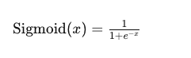
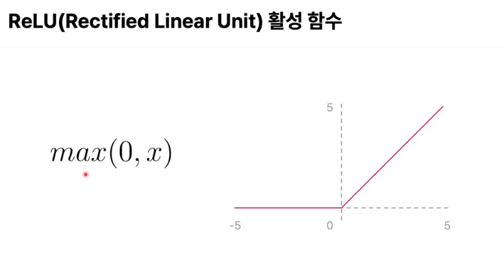

# Pytorch 

#### 소개:
- Meta 에서 만든 머신러닝 프레임워크임. 
- Tensor 연산을 효율적으로 다룰 수 있고, CUDA 를 이용해서 GPU 를 이용한 연산도 효율적으로 다룰 수 있다. 
- 파이토치 생태계에서는 TorchVision, TorchAudio 도 포함되어 있어서 주요 딥러닝 신경망도 편리하게 이용할 수 있음.
- 국내에서는 Pytorch 를 Tensorflow 보다 더 많이 사용하고 있다고 함. 

*** 

#### Q) CUDA 를 이용한 GPU 연산은 텐서를 효율적으로 처리하기 보다는 행렬을 효율적으로 처리하기 위한거지?

아니다. 

CUDA 는 행렬 연산 뿐 아니라 텐서 연산에서도 최적화 되어 있음. 

***

#### Pytorch 학습 순서: 
- 1. Tensor: Pytorch 의 Tensor 개념을 이해하고, Tensor 연산을 실습해보는 것  
- 2. nn.Module: 신경망 구성을 위한 모듈을 이해하고 MNIST 샘플 신경망을 구성해보는 것.  
- 3. Training with Pytorch: MNIST 학습 데이터셋을 이용해서 모델을 학습하고, 학습된 모델을 평가해보는 것.  
- 4. TorchServe: 학습한 모델을 추론해보고, TorchServer 를 통해 모델을 서빙해보는 것.  
- 5. 최적화 알고리즘: SGD, Adam 알고리즘을 이해하고, Cross Entropy, MSE 등의 Loss Function 을 이해해보는 것. 

*** 


#### Q) MNIST 샘플 신경망이 뭐지? 

MNIST 샘플 신경망은 손으로 쓴 숫자를 인식하는 문제에 대한 표준적인 기계 학습 모델 예제 중 하나임. 

MNIST 데이터셋은 0부터 9까지의 숫자를 손으로 쓴 70,000개의 작은 그레이스케일 이미지로 구성되어 있음. 

이 데이터셋은 머신러닝과 딥러닝의 세계에서 "Hello World" 프로그램과 같은 역할을 함.

MNIST 샘플 신경망은 다음과 같은 구성 요소를 포함하고 있다: 
- 입력층(Input Layer): 이 층은 28x28 픽셀의 이미지를 입력으로 받아, 이를 784개의 뉴런(각 픽셀당 하나의 뉴런)으로 변환하여 신경망에 공급한다. 
- 은닉층(Hidden Layers): 하나 이상의 은닉층이 있을 수 있으며, 각 층은 여러 뉴런으로 구성된다. 뉴런들은 가중치와 활성화 함수를 통해 입력받은 신호를 처리한다. 일반적으로 이러한 층에서는 ReLU(Rectified Linear Unit)와 같은 비선형 활성화 함수가 사용된다. 
- 출력층(Output Layer): 이 층은 10개의 뉴런으로 구성되어 있으며, 각 뉴런은 하나의 숫자(0에서 9까지)에 해당한다. 출력층은 보통 softmax 활성화 함수를 사용하여, 각 숫자에 대한 확률을 출력한다. 
- 손실 함수(Loss Function): 모델의 예측과 실제 라벨 사이의 차이를 측정하기 위해 사용된다. 분류 문제에서는 일반적으로 크로스 엔트로피 손실 함수가 사용된다. 
- 최적화 알고리즘(Optimizer): 손실 함수를 최소화하기 위해 가중치를 조정하는 방법을 정의한다. 대표적인 예로는 SGD(Stochastic Gradient Descent), Adam 등이 있다. 

*** 


#### Q) MNIST 에서 최적화 알고리즘은 뭐야? 경사하강법 같은건가? 

맞다. 경사 하강법의 변형들임. 

네트워크의 가중치를 조정하여 손실 함수의 값을 최소화하는 방향으로 학습을 진행한다. 

SGD (Stochastic Gradient Descent) 는  가장 기본적인 형태의 경사 하강법임. 각 반복에서 무작위로 선택된 하나의 데이터 샘플(또는 작은 배치)을 사용하여 가중치를 업데이트한다. 이 방식은 계산 효율성이 높으며, 많은 데이터에도 확장이 용이함.

***

#### Tensor 종류: 
- 단일 값이 스칼라, 리스트 값이 벡터, 행렬 값이 매트릭스, 더 나아가 3D 구조로 된 3D Tensor or Cube 이렇게 있다.  

***

#### Q) Python 에 존재하는 리스트 타입 같은 걸 이용하지 않고 Tensor 단위로 사용하는 이유는? 

Tensor 는 하드웨어 도움을 받아서 한번에 처리할 수 있어서. 

CUDA 를 이용하면 행렬을 한번에 계산할 수 있다. 

***


#### Tensor 계산은 그래프를 통해서 이뤄진다: 
- PyTorch가 연산을 수행할 때 내부적으로 "계산 그래프"(computation graph)를 구성하고 사용한다는 의미임. 
- 계산 그래프는 수행할 연산과 연산에 관여하는 텐서들 간의 관계를 노드와 엣지로 표현한 그래프 구조이다. 
- 이 방식은 특히 딥러닝에서 역전파 알고리즘을 통해 그래디언트를 효율적으로 계산할 때 중요한 역할을 한다고 함:
- 그래프 구조이기 때문에 최종 연산 결과인 텐서에서도 어떻게 이 결과가 나왔는지 추적할 수 있다.

***


#### Torch 의 nn.Module 클래스: 
- 레이어나 신경망을 정의할 때 사용하는 기본 클래스이다. 
- nn.Module 은 내부적으로 모델의 파라미터를 자동으로 추적하는 기능이 있다. 그리고 parameters() 메소드를 토해 모델의 파라미터를 반환할 수 있음.
- 복잡한 신경망은 여러개의 레이어를 가질 수 있는데 이건 nn.Module 객체가 여러개 있다는 거임. 
- forward() 메소드를 통해 전방 계산을 할 수 있다. 즉 입력 데이터를 모델에 주면 결과를 출력해볼 수 있는거임. 
- nn.Module 은 .train() 과 .eval() 메소드를 통해서 모델의 학습 모드와 평가 모드를 전화할 수 있다. 
- 그리고 .save() 와 .load() 메소드를 통해 모델을 저장하고 로드할 수 있다.

***


#### 간단한 신경망 정의 방법 
```python
import torch
import torch.nn as nn
import torch.nn.functional as F

class SimpleNet(nn.Module):
    def __init__(self):
        super(SimpleNet, self).__init__()
        self.fc1 = nn.Linear(10, 50)  # 입력 특성 10개, 출력 특성 50개
        self.fc2 = nn.Linear(50, 2)   # 입력 특성 50개, 출력 특성 2개

    def forward(self, x):
        x = F.relu(self.fc1(x))
        x = self.fc2(x)
        return x
```

***


#### 레이어를 많이 쌓으면 일어나는 일: 
- 어렵고 복잡한 패턴을 파악하기 쉬워진다. 
- 계산양이 많아지고, 추론속도가 느려진다. 

***


#### Q) nn.Module 의 Full Connected 는 뭐야? 

nn.Module에서 "Fully Connected" 층은 주로 nn.Linear 클래스를 사용하여 구현된다. 

Fully Connected" 층, 또는 밀집층(dense layer)이라고도 불리는 이 층은 신경망에서 모든 입력 노드가 다음 층의 모든 노드와 연결되어 있는 네트워크 구조를 의미한다. 

***

#### Q) nn.Module 클래스에서 nn 이 붙은 이유는 뭐야? 

PyTorch에서 nn은 "neural networks"의 약자로, 신경망을 구성하는 데 필요한 다양한 도구와 레이어를 포함하는 모듈임. 

nn은 PyTorch의 하위 모듈 중 하나로, 주로 신경망을 구성하는 레이어, 활성화 함수, 손실 함수 등을 제공한다. 이 모듈을 통해 사용자는 딥러닝 모델을 보다 쉽게 구축하고 관리할 수 있다. 

***

#### Q) nn.Linear 은 그럼 nn.Module 을 상속한 클래스야? 

맞다. 

nn.Linear는 신경망에서 가장 기본적인 레이어 중 하나로, 선형 변환을 수행하는 레이어임. 이 레이어는 입력 데이터에 가중치 행렬을 곱하고 편향을 더해서 출력을 생성한다. 

nn.Linear의 주요 구성: 
- 가중치(weights): 각 입력 특성과 출력 뉴런 사이의 연결 강도를 나타내는 매개변수임. 
- 편향(biases): 각 출력 뉴런에 추가되는 상수 값으로, 출력을 조절하는 역할을 한다. 

nn.Linear 클래스는 다음과 같은 파라미터를 필요로 함. 
- in_features: 입력 특성의 수.
- out_features: 출력 특성의 수.
- bias: 편향을 사용할지 여부를 나타내는 불리언 값. 기본값은 True임. 


```python
import torch.nn as nn

# 입력 특성이 10개, 출력 특성이 5개인 선형 레이어 생성
linear_layer = nn.Linear(in_features=10, out_features=5)

```

***

#### Q) 드롭아웃과 배치 최적화는 하이퍼파라미터 튜닝이지? 이게 뭐야? 

드롭아웃과 배치 정규화는 신경망을 트레이닝할 때 사용하는 기술임. 

이들의 설정값을 조절하는 것은 하이퍼파라미터 튜닝의 일부이다.

하이퍼파라미터 튜닝은 모델의 성능을 최적화하기 위해 학습 과정에서 조정할 수 있는 매개변수들을 실험적으로 최적화하는 과정이다.

드롭아웃(Dropout):
- 드롭아웃은 과적합을 방지하기 위해 신경망 학습 과정 중에 무작위로 일부 뉴런을 비활성화(즉, 그 뉴런의 출력을 0으로 설정)하는 기술임. 
- 이 방법은 네트워크가 일부 특정 뉴런에 과도하게 의존하는 것을 막고, 다양한 뉴런의 조합을 통해 데이터를 학습하게 함으로써 일반화 능력을 향상시키기 위한 것. 
- 드롭아웃 비율은 하이퍼파라미터로, 일반적으로 0.2에서 0.5 사이에서 설정한다. 

배치 정규화(Batch Normalization): 
- 배치 정규화는 신경망의 각정 층에서 활성화 출력을 정규화(평균을 0으로, 분산을 1로 조정)하여 학습 과정을 안정화하고 가속화하는 기술임. 
- 이 기술은 내부 공변량 변화(internal covariate shift)를 줄여주며, 이는 학습 과정에서 각 층의 입력 분포가 변하는 문제를 완화시키는 효과가 있다. 
- 배치 정규화는 각 층의 입력 데이터를 정규화한 후 학습 가능한 파라미터를 통해 스케일과 시프트를 조정한다. 

***

#### Q) 내부 공변량 변화는 뭐지?

내부 공변량 변화(Internal Covariate Shift)는 신경망을 학습할 때 발생할 수 있는 문제 중 하나임. 

신경망의 각 층을 거치면서 입력 데이터의 분포가 계층을 지나면서 계속 변한다는 개념이다. 

즉, 네트워크의 각 층이 학습 과정 중에 계속 변화하는 데이터 분포에 적응해야 하는 상황을 말한다. 

내부 공변량 변화로 인한 영향은 다음과 같다: 
- 학습 속도 저하: 각 층의 입력 분포가 계속 변하면, 각 층의 가중치를 적절히 조절하는 것이 더 어려워집니다. 이는 네트워크가 더 천천히 학습되게 만들 수 있다. 
- 과적합 위험 증가: 네트워크의 깊은 층이 이전 층의 변화에 민감하게 반응할 때, 모델이 훈련 데이터의 노이즈에 더 쉽게 영향을 받을 수 있다. 
- 학습 안정성 감소: 입력 분포의 지속적인 변화는 모델의 수렴을 더 어렵게 만들고, 때로는 학습이 불안정해질 수 있다. 


***

#### Q) 배치 정규화에서 활성화 출력을 정규화 하는 것이 왜 학습 과정을 안정화시키는거지? 

배치 정규화에서 활성화 출력을 정규화하는 것이 학습 과정을 안정화시키는 데 도움이 되는 몇 가지 주요 이유가 있다: 
- 가중치 초기화 의존성 감소: 일반적으로 신경망을 훈련할 때 가중치 초기화가 매우 중요하다. 잘못된 초기화는 네트워크의 학습을 느리게 하거나 전혀 학습되지 않게 만들 수 있다. 배치 정규화는 각 층의 입력을 정규화하여, 네트워크의 초기 가중치에 대한 의존성을 줄이고, 더 넓은 범위의 초기 가중치 설정에서도 모델이 잘 작동할 수 있도록 한다.
- 학습률 증가: 배치 정규화는 각 층의 입력 분포를 안정화시킴으로써, 높은 학습률에서도 모델이 수렴할 가능성을 높인다. 높은 학습률을 사용할 수 있게 되면, 그만큼 학습 과정이 빨라지고 더 빠르게 좋은 성능에 도달할 수 있다.
- 내부 공변량 변화 억제: 배치 정규화는 각 층의 입력을 정규화하여 그 분포를 비슷하게 유지함으로써, 학습 동안 네트워크 파라미터의 작은 변경이 출력에 미치는 영향을 줄인다. 이는 내부 공변량 변화를 감소시키며, 결과적으로 각 층이 더 안정적으로 학습될 수 있게 한다. 
- 그라디언트 소실 및 폭발 문제 완화: 심층 네트워크에서는 그라디언트 소실 또는 폭발이 자주 발생할 수 있는데, 이는 그라디언트가 네트워크를 통과하면서 점차 사라지거나 지나치게 커지는 현상이다. 배치 정규화는 각 층의 활성화를 적절한 범위 내에서 유지함으로써 이러한 문제를 완화시킬 수 있다. 
- 과적합 방지: 배치 정규화는 미니 배치마다 평균과 분산을 계산하는 과정에서 일종의 노이즈를 추가하게 되는데, 이는 모델이 더 강인해지게 만들어 과적합을 방지하는 효과를 가질 수 있다. 

***

#### Q) 학습 과정이 안정화된다는 건 학습 과정이 길지 않다는 걸 의미하는건가? 아니면 전역 최소점에 도달할 수 있음을 의미하는건가? 

학습 과정이 안정화된다는 건 다음 두 가지 요소를 모두 포함하는 개념이다: 
- 학습 과정의 속도: 학습 과정이 안정화되면 일반적으로 학습 속도가 빨라진다. 이는 모델이 학습 데이터에 대해 더 효과적으로 학습하고, 더 빨리 수렴할 수 있음을 의미한다. 즉, 모델이 최적의 가중치를 찾아가는 데 필요한 에포크 수가 감소할 수 있다. 
- 수렴의 질: 또한, 안정화된 학습 과정은 모델이 전역 최소점에 더 가까워질 가능성을 높인다. 이는 네트워크가 보다 일관된 학습 패턴을 따르고, 이상적인 학습률과 초기화 조건 하에서 최적의 결과를 달성할 수 있음을 의미한다. 여기서 전역 최소점이란, 손실 함수가 가능한 가장 낮은 값을 가지는 지점을 말한다. 

***

#### Q) 배치 정규화를 하지 않아서 내부 공변량이 일어나서 각 층의 입력 분포가 변하는게 학습에 불안정한 영향을 주는 것 같은데 왜 불안정한 영향을 주는거지? 수렴하는 방향으로 업데이트가 되지 않아서 그런거야? 

맞다. 

내부 공변량 변화가 발생하면 각 층의 입력 분포가 학습 과정 동안 계속 변화하게 되어, 이는 다양한 방식으로 학습에 불안정한 영향을 줄 수 있다. 

1) 가중치 업데이트의 복잡성 증가: 

각 층의 입력 분포가 계속 변하면, 각 층의 가중치를 적절히 조정해야 하는 필요성이 증가한다. 

이 때문에 네트워크는 적절한 가중치 업데이트를 찾기 위해 더 많은 학습을 요구하게 되고, 이는 학습 과정을 느리게 할 수 있다. 

가중치가 적절히 조정되지 않으면, 네트워크는 수렴하지 않거나 예상치 못한 방향으로 수렴할 수 있다. 


2) 그라디언트 소실 및 폭발

내부 공변량 변화는 특히 깊은 신경망에서 문제를 일으킬 수 있다. 

입력 분포의 변화로 인해 활성화 함수를 통과한 후의 그라디언트가 소실되거나 폭발할 수 있다. 

예를 들어, 신경망에서 사용되는 시그모이드나 탄젠트와 같은 활성화 함수는 입력 값이 너무 크거나 작을 때 그라디언트가 매우 작아지는 현상(그라디언트 소실)을 겪을 수 있다. 

이는 깊은 층으로 갈수록 학습이 거의 이루어지지 않게 만들 수 있다. 

***

#### Q) 입력 분포가 계속 변하면 각 층의 가중치를 조절하는게 어렵다고 하고, 적절한 가중치를 업데이트 하기 위해 더 많은 학습을 요구한다고 하는데 이 부분에 대해서 이해가 안가서 쉽게 설명해줘.

신경망에서 각 층은 입력 데이터에 대해 특정 변환(가중치와 활성화 함수를 사용한 연산)을 수행한다. 

각 층의 출력은 다음 층의 입력이 됩니다. 만약 한 층의 입력 분포가 계속 변한다면, 그 층이 학습해야 할 패턴 또한 계속 변하게 된다. 

이는 각 층이 끊임없이 변화하는 데이터에 적응하기 위해 계속해서 다른 방식으로 조정되어야 함을 의미한다. 

예를 들어 레스토랑에서 요리사가 특정 요리법에 따라 요리를 만들어야 한다고 생각해보자. 

만약 재료의 맛이나 질감이 매번 달라진다면, 요리사는 매번 요리 방법을 조금씩 조정해야 한다. 이와 유사하게, 신경망의 각 층도 입력 데이터의 변화에 맞추어 가중치를 계속 조정해야 한다. 

***

#### 실습: XORModel 

XOR 문제는 선형적으로 구분할 수 없는 문제로 알려져 있기 때문에, 이를 해결하기 위해 여기서는 비선형 활성화 함수인 시그모이드를 사용하는 두 개의 레이어를 사용한다. 

```python
class XORModel(nn.Module): 
    def __init__(self):
        super(XORModel, self).__init__()
        self.layer1 = nn.Linear(2, 2) # 입력 2개, 출력 2개인 레이어 1 
        self.layer2 = nn.Linear(2, 1) # 입력 2개, 출력이 1개인 레이어 2 
        self.sigmoid = nn.Sigmoid()
        
    def forward(self, x):
        x = self.sigmoid(self.layer1(x))
        x = self.sigmoid(self.layer2(x))
        return x
```
- self.sigmoid = nn.Sigmoid(): 시그모이드 활성화 함수를 인스턴스한다. 시그모이드는 각 노드의 출력을 0과 1 사이로 제한하는 비선형 함수로, 이진 분류 문제에 적합하다. 
- forward 함수는 모델에 데이터를 전달할 때 호출되는 함수입니다. 입력 데이터 x를 받아 순전파 과정을 통해 최종 출력을 계산한다. 
- x = self.sigmoid(self.layer1(x)): 첫 번째 선형 층 layer1을 통해 입력 x가 전달되고, 그 결과는 시그모이드 함수를 통해 비선형 변환된다. 이 단계는 입력 데이터에 초기 변환을 적용하고 비선형성을 추가하여 다음 레이어로 전달한다. 
- x = self.sigmoid(self.layer2(x)): 두 번째 선형 층 layer2를 통해 데이터가 전달되고, 그 결과 또한 시그모이드 함수를 통해 비선형 변환된다. 이는 최종적으로 0 또는 1의 출력을 생성한다.

***

#### Q) Pytorch 로 문제를 해결하는 딥러닝 모델을 만들 때는 이렇게 forward 함수를 늘 정의해야해? 각 레이어에서 어떻게 계산하는지 같은 것들을? 

PyTorch에서 사용자 정의 신경망 모델을 만들 때는 일반적으로 forward 함수를 정의해야 한다. 

이 함수는 모델의 순전파(forward propagation) 단계를 정의하며, 모델이 어떻게 입력 데이터를 받아들이고, 그 데이터를 여러 신경망 레이어와 활성화 함수를 거쳐서 출력을 생성하는지 설명하는 부분이다. 

forward 함수는 PyTorch가 모델을 훈련하거나 평가할 때 자동으로 호출되며, 개발자는 이 함수를 통해 데이터가 모델을 통해 어떻게 흐르는지 제어할 수 있다. 모델의 복잡도나 특성에 따라 forward 함수 내의 로직은 단순하거나 매우 복잡할 수 있다. 

***

#### Q) 대부분의 경우에  사용자 정의 신경망 모델을 사용해? 아니면 사용자 정의 신경망 모델을 사용하지 않는 경우도 있어? CNN, RNN 이런걸 사용하는 건 사용자 정의 신경망 모델이 아닌건가? 

일반적인 신경망 아키텍처(CNN, RNN, LSTM 등)를 위한 미리 구현된 모듈을 제공하며, 이러한 표준 모듈들을 사용하여 많은 일반적인 문제를 해결할 수 있다. (즉 사용자 정의 신경망 모델이 아닌거지) 
- 이미지 분류, 시퀀스 예측, 텍스트 처리와 같은 일반적인 문제는 CNN, RNN, LSTM 등과 같은 표준 아키텍처를 사용하여 효과적으로 해결할 수 있다. 
- 이미지 처리에는 주로 CNN을 사용하고, 시퀀스 데이터나 시계열 데이터에는 RNN이나 LSTM을 사용한다. 

특정 작업에 맞추어 복잡한 아키텍처를 구현해야 할 때 사용자 정의 모델이 필요할 수 있다. 

예를 들어, 특정 유형의 데이터를 처리하기 위해 비표준 데이터 흐름이나 특별한 계산 레이어를 필요로 하는 경우임. 

***

#### Q) 이전 예제에서 sigmoid 함수를 정의한 이유는 입력이 주어졌을 때 어떻게 계산할 지 미리 정해놓는건가? 딥러닝에서는 이렇게 해야하는건가? 이것말고 다른 함수들은 무엇이 있지?
 
sigmoid 같은 활성화 함수는 각 레이어의 출력에 적용되어 다음 레이어로 전달되기 전에 비선형 변환을 수행한다. 

이런 활성화 함수를 사용하는 주요 목적은 네트워크에 비선형성을 추가하는 것임. 

활성화 함수의 종류와 특성:
- 시그모이드 (Sigmoid):
  - 범위: 0과 1 사이.
  - 특징: 주로 이진 분류 문제의 마지막 레이어에서 출력을 확률로 표현할 때 사용한다. 
  - 단점: 그라디언트 소실 문제(vanishing gradient)가 발생할 수 있고, 출력이 0 또는 1에 가까울 때 그라디언트가 매우 작아집니다.

- 하이퍼볼릭 탄젠트 (Tanh):
  - 범위: -1과 1 사이.
  - 특징: 중심이 0으로 이동되어 있어 학습 초기 단계에서 시그모이드보다 선호된다. 
  - 단점: 그라디언트 소실 문제가 여전히 존재한다. 

- 렐루 (ReLU - Rectified Linear Unit):
  - 범위: 0에서 무한대.
  - 특징: 연산이 간단하며, 많은 경우에 좋은 성능을 보여주어 현재 가장 널리 사용되는 활성화 함수임. 
  - 단점: 죽은 렐루 문제(dead ReLU problem), 즉 일부 뉴런이 0 이하의 입력에서 활성화되지 않고 그라디언트도 전달되지 않는 문제가 발생할 수 있습니다.

- 리키 렐루 (Leaky ReLU):
  - 범위: 모든 실수.
  - 특징: 죽은 렐루 문제를 해결하기 위해 음수 입력에 대해 매우 작은 기울기를 부여한다. 
  - 사용: ReLU의 변형으로 널리 사용되고 있다. 

- 소프트맥스 (Softmax):
  - 범위: 0과 1 사이, 전체 출력 합은 1.
  - 특징: 주로 다중 클래스 분류 문제의 출력 레이어에서 사용된다. 클래스 확률을 출력하기 위해 사용된다. 
  - 사용: 각 클래스에 대한 확률을 계산하여 가장 높은 확률을 가진 클래스를 모델의 예측으로 선택한다. 


***

#### Q) 신경망 네트워크에 비선형성을 추가하는 이유는 뭐야? 대부분의 문제는 비선형성을 띄어서 그런건가?  

맞다. 

실제 세계의 데이터와 문제들이 대부분 비선형 특성을 지니기 때문임. 

비선형 활성화 함수를 통해 신경망은 복잡한 함수를 근사할 수 있다. 이는 신경망이 단순한 선형 모델로 표현할 수 없는 복잡한 결정 경계와 관계를 학습할 수 있게 해준다. 

비선형 활성화 함수를 사용함으로써 신경망은 비선형 데이터에 대한 더 좋은 일반화와 예측 성능을 보여줄 수 있다. 선형 모델은 데이터의 복잡한 패턴을 포착하기에 한계가 있음. 


***

#### Q) 그라디언트 소실 문제가 뭔데? 더 나아가서 시그모이드 활성화 함수를 사용할 때 발생하는 그라디언트 소싦 문제는 또 뭔데?  

그라디언트 소실 문제(vanishing gradient problem)는 딥러닝 모델, 특히 깊은 신경망을 학습할 때 발생할 수 있는 중대한 문제 중 하나임. 

신경망의 가중치를 업데이트하는 과정에서 발생하며, 신경망의 뒤쪽 레이어에서부터 앞쪽 레이어로 그라디언트(오류의 기울기)가 전파되면서 점점 감소하는 현상을 말한다. 

이렇게 그라디언트가 점점 작아지면 앞쪽 레이어의 가중치는 거의 업데이트되지 않게 되어, 네트워크 학습이 효과적으로 이루어지지 않는다. 

시그모이드 활성화 함수와 그라디언트 소실 문제: 
- 시그모이드 활성화 함수는 출력 값이 0에서 1 사이로 제한되며, 함수의 형태가 S자 모양입니다. 이 활성화 함수의 수학적 표현은 다음과 같다:


- 시그모이드 함수의 문제점은 그라디언트를 계산할 때 발생합니다. 시그모이드 함수의 도함수는 다음과 같다:


- 이 도함수의 값은 입력값 x가 0에 가깝거나 매우 크거나 매우 작을 때 매우 작아지는 특성잉 있다. 

- 이는 네트워크가 깊어질수록 또는 연속적인 계산에서 입력값이 클 경우 그라디언트가 점점 작아지는 결과를 초래하며, 결과적으로 네트워크의 앞부분에 위치한 레이어의 가중치는 거의 업데이트되지 않게 된다.

- 이로 인해 신경망 학습이 제대로 이루어지지 않게 되며, 이를 그라디언트 소실 문제라고 함. 

- 이 문제를 완화하기 위해 다양한 방법들이 제안되었음. 가장 흔한 해결책 중 하나는 ReLU(Rectified Linear Unit) 활성화 함수와 그 변형들을 사용하는 것이다. ReLU 함수는 입력이 양수일 경우 그대로 출력하고, 음수일 경우 0을 출력한다. 이 함수는 양수 입력에 대해 그라디언트가 항상 1이므로 그라디언트 소실 문제에 효과적이다. 
- 다른 해결 방안으로는 가중치 초기화 기법 개선, 배치 정규화, 적절한 학습률 스케줄링 등이 있다. 

***

#### Q) 죽은 렐루 문제(dead ReLU problem) 는 입력값으로 0 미만이 들어와서 ReLU 함수가 호출되지 않는 문제를 말하는거지? 그리고 Leaky ReLU 는 음수 입력에서도 출력을 할 수 있도록 만드는거고. 

맞다. 

ReLU 함수는 입력이 0 이하일 경우 출력을 0으로 만든다.  

따라서, 어떤 뉴런이 한번 0 이하의 입력을 받게 되면, 그 후로는 계속 0을 출력하게 되어, 학습 과정에서 그 뉴런이 더 이상 업데이트되지 않는 상황이 발생한다. 

***

#### Q) 신경망 네트워크에서 레이어는 뒤쪽에서 앞쪽 방향으로 업데이트 되는건가? 그래서 Backpropagation 이라고 부르는건가?

맞다. 

신경망에서의 가중치 업데이트는 일반적으로 역전파(Backpropagation) 알고리즘을 통해 이루어진다. 

역전파는 신경망의 출력층에서부터 입력층 방향으로 오차의 그라디언트를 전파하면서 각 레이어의 가중치를 업데이트하는 과정이다. 

역전파의 주요 단계:
- 1. 전방 전파(Forward Propagation):
  - 입력 데이터는 입력층에서부터 출력층까지 순차적으로 각 레이어를 통과한다.  
  - 각 레이어는 가중치와 활성화 함수를 사용하여 입력을 처리하고 다음 레이어로 결과를 전달한다.  
  - 최종적으로, 출력층에서 네트워크의 예측 결과가 생성된다. 
- 2. 오차 계산:
  - 출력층에서 예측된 결과와 실제 타깃(레이블) 사이의 오차를 계산한다.  이 오차는 손실 함수(loss function)를 사용하여 수치화된다. 
- 3. 역방향 전파(Backward Propagation):
  - 계산된 오차를 바탕으로, 출력층에서부터 시작하여 입력층의 방향으로 그라디언트(가중치에 대한 오차의 편미분)를 계산한다. 
  - 이 과정은 연쇄 법칙(chain rule)을 사용하여 각 레이어의 가중치에 대한 오차의 기여도를 찾아낸다. 
  - 각 레이어의 가중치는 이 그라디언트를 사용하여 업데이트된다.  이때 학습률(learning rate)이라는 매개변수가 그라디언트의 크기를 조절하여 가중치의 조정 정도를 결정한다. 

- 4. 반복 과정:
  - 이 전체 과정은 네트워크의 성능이 향상될 때까지, 즉 손실이 최소화될 때까지 반복된다. 

***

#### Q) 정방향을 사용하지 않고 역방향으로 가중치를 업데이트 하는 이유는 뭐야?  

출력층의 오류를 잡는 것이 더 중요해서. 

출력층에서 계산된 오류는 모델의 예측이 실제 값과 얼마나 차이가 나는지를 직접적으로 나타낸다. 

***

#### Q) 다음 Pytorch 의 모델 초기화 코드는 뭐지? 

```python
# 모델 초기화 
criterion = nn.BCELoss()
optimizer = optim.SGD(model.parameters(), lr=0.1)
```
- 손실함수 설정: nn.BCELoss()는 Binary Cross Entropy Loss, 즉 이진 크로스 엔트로피 손실 함수를 생성한다. 이 함수는 이진 분류 문제에서 사용되며, 모델이 예측한 확률과 실제 레이블 사이의 차이를 측정한다. 
- optim.SGD는 확률적 경사 하강법(Stochastic Gradient Descent, SGD) 최적화 함수를 생성한다. 이 함수는 모델의 가중치를 업데이트하여 학습 과정에서 손실을 최소화하는 데 사용된다.
- model.parameters()는 최적화할 모델의 파라미터(가중치와 편향)를 가져오는 함수이다.  이는 SGD 알고리즘에서 업데이트될 변수들임. 
- lr=0.1은 학습률(learning rate)을 의미하며, 이는 가중치 업데이트 시 그라디언트의 크기를 조절한다. 학습률이 너무 높으면 학습이 불안정해질 수 있고, 너무 낮으면 학습 속도가 느려질 수 있다. 

***

#### Q) 다음 Pytorch 의 학습하는 코드는 뭐지? 

```python
for epoch in range(10001): 
    # Forward pass 
    outputs = model(x_data)
    loss = criterion(outputs, y_data)
    
    # Backward pass and optimization 
    optimizer.zero_grad()
    loss.backward()
    optimizer.step()
    if (epoch % 1000 == 0): 
        print(f'Epoch [{epoch/10000}, Loss: {loss.item():.4f}')
```

- epoch는 학습 과정을 통해 데이터를 반복해서 학습시키는 횟수를 나타낸다. 여기서는 총 10,001번의 에폭(epoch) 동안 모델을 학습시킨다. 
- model(x_data): 모델에 입력 데이터 x_data를 넣어 예측 결과 outputs를 받는다. 
- loss = criterion(outputs, y_data): 예측 결과와 실제 레이블 y_data를 손실 함수 criterion에 넣어 계산한다. 이 손실 값은 모델의 예측이 얼마나 잘못되었는지를 나타내며, 이 값을 최소화하는 것이 학습의 목표임. 
- optimizer.zero_grad(): 기존에 계산된 그라디언트 값을 초기화한다. PyTorch는 기본적으로 그라디언트를 누적하기 때문에, 각 학습 단계에서 이를 초기화해주어야 한다. 
- loss.backward(): 손실 함수로부터 그라디언트를 자동으로 계산하여 역방향으로 전파한다. 이 과정에서 각 파라미터의 손실 함수에 대한 미분값이 계산된다. 
- optimizer.step(): 계산된 그라디언트를 사용하여 모델의 파라미터를 업데이트한다. 이는 optim.SGD 등의 최적화 알고리즘을 통해 이루어진다. 


***

#### Q) 왜 기존에 계산된 그라디언트 값을 epoch 때마다 초기화하는거지? 누적해서 그라디언트 값을 업데이트 해야하는거 아닌가? 

그라디언트 값을 매 에폭마다 초기화하는 이유는 그라디언트가 기본적으로 누적되기 때문임. 

이는 PyTorch 설계의 일부로, 여러 미니배치들에 걸쳐 그라디언트를 누적하는 것을 가능하게 한다. 

하지만 일반적인 학습 시나리오에서는 각 에폭이 독립적인 계산을 대표하므로, 누적된 그라디언트를 초기화하지 않으면 이전 에폭에서 계산된 그라디언트가 현재 에폭의 업데이트에 영향을 미치게 된다. 

***

#### Q) 손실함수 결과인 loss 를 전달받지 않고, optimizer.step() 만 해도 모델 파라미터를 업데이트 할 수 있는 이유는 뭐야?


loss.backward() 메소드를 호출하면 손실값에 대한 그라디언트 값이 계산되고, 이 값이 .grad 에 저장되고, optimizer 내부에서는 .grad 값을 참조하고 있으니까 저장된 그라디언트값에 접근할 수 있고 모델 파라미터를 업데이트하면 됨. 

이 과정에서 설정된 학습률(learning rate)을 기반으로 파라미터를 조정하게 된다. 

그러니 손실 값 자체는 이 과정에 직접적으로 필요하지 않다. 오직 그 파라미터에 연결된 그라디언트 정보만 사용된다. 

***

#### MNIST 테스크 구조 


*** 

#### MNIST 신경망 구조 


- 784 개의 유닛은 입력값으로 784 개의 데이터가 들어온다는거임. 하나의 이미지라서 하나의 데이터가 들어오는게 아니다. 이미지에는 여러개의 픽셀이 있을 거임. 
- 글자를 구별하는 이미지에는 흰색 픽셀값, 검은색  픽셀값, 회색 픽셀값 이렇게 값이 있을것이고 이 값들이 모여서 신경망 모델로 들어오는 거

***

#### Q) MNIST 모델은 왜 500개의 히든 레이어로 설정한거야? 어떻게 500이라는 숫자를 정한거지? 

MNIST 데이터셋을 위한 신경망 모델에서 500개의 뉴런을 가진 히든 레이어를 설정하는 것은 다양한 요인에 기반하여 결정될 수 있다. 

중요한 건 이 숫자가 반드시 고정된 규칙을 따르는 것이 아니라, 모델 설계자가 실험을 통해 결정하는 경험적인 요소가 크다는 거임 
- 모델의 복잡성과 성능: 더 많은 뉴런을 포함하는 히든 레이어는 더 복잡한 패턴을 학습할 수 있는 능력을 갖지만, 과적합(overfitting)을 유발할 위험도 증가한다. 반면, 너무 적은 뉴런은 모델이 데이터의 중요한 특징을 충분히 학습하지 못하는 문제를 일으킬 수 있다. 
- 리소스 및 계산 시간: 히든 레이어의 크기는 훈련에 필요한 계산 리소스와 시간에도 영향을 미친다. 레이어가 클수록 모델을 훈련시키고 예측을 수행하는 데 더 많은 계산력과 시간이 필요하다. 
- 실험과 검증: 실제로 많은 데이터 과학자와 연구원들은 다양한 레이어 크기와 구조를 실험하여 최적의 모델 성능을 도출한다. 이 과정에서 교차 검증과 같은 기법을 사용하여 모델의 일반화 능력을 평가하고, 최적의 레이어 크기를 결정하게 된다. 

*** 

#### Q) 레이어의 수 같은 하이퍼파라미터는 경험적인 요소가 크다고하면 AutoML 을 쓰는게 나을 수 있겠네?

맞다. 

AutoML(Automated Machine Learning)을 사용하는 것은 하이퍼파라미터 튜닝 과정을 자동화하여 시간을 절약하고, 더욱 객관적이고 체계적인 방법으로 최적의 모델 구조를 찾을 수 있는 효과적인 방법이 될 수 있다. 


*** 

#### 다음 Pytorch 코드는 무엇을 의미하는가? 

```python
import torch
import torch.nn as nn 
import torchvision.datasets as dsets 
import torchvision.transforms as transforms 
import matplotlib.pyplot as plt 
from itertools import islice
from torch.autograd import Variable

input_size = 784 # 이미지 사이즈 
hidden_size = 500 # 히든 레이어 숫자 
num_classes = 10  # 출력 테스트 종류 
num_epochs =  20 # 학습에 사용할 Epoch 수 
batch_size = 100 # 학습 입력 배치 크기 
lr = 1e-3 # 학습률 

train_data = dsets.MNIST(root="./data", train=True, transform=transforms.ToTensor(), download=True)
test_data = dsets.MNIST(root="./data", train=False, transform=transforms.ToTensor())

train_loader = torch.utils.data.DataLoader(dataset=train_data, batch_size=batch_size, shuffle=True)
test_loader = torch.utils.data.DataLoader(dataset=test_data, batch_size=batch_size, shuffle=False)
```
- train_data: 
  - train_data는 MNIST 데이터셋의 훈련 세트를 정의한다. 
  - root="./data"는 데이터셋을 저장할 로컬 디렉토리를 지정한다. 
  - train=True는 훈련 데이터셋을 로드하겠다는 것을 의미한다. 
  - transform=transforms.ToTensor()는 데이터셋의 이미지를 파이토치 텐서로 변환하는 변환 작업을 지정한다. 이 변환을 통해 이미지의 픽셀 값 범위가 [0, 255]에서 [0.0, 1.0]으로 조정되고, 이미지 형식이 PyTorch에서 사용하기 적합한 텐서로 변경된다. 
  - download=True는 데이터셋이 지정된 경로에 없을 경우 인터넷에서 다운로드하도록 설정한다. 

- test_data: 
  - test_data는 MNIST 데이터셋의 테스트 세트를 정의한다. 
  - 여기서 train=False는 테스트 데이터셋을 로드하겠다는 것을 의미하며, 나머지 매개변수는 훈련 데이터셋과 유사하다. 

- train_loader: 
  - train_loader는 train_data를 입력으로 사용하는 데이터 로더를 생성한다. 
  - batch_size=batch_size는 각 배치에 포함될 데이터의 수를 지정한다.
  - shuffle=True는 에포크마다 데이터셋을 섞어서 데이터가 모델에 공급되는 순서를 랜덤하게 만든다. 이는 모델이 특정 데이터 순서에 의존하지 않도록 하여 일반화 성능을 향상시킬 수 있다. 

- test_loader: 
  - test_loader는 test_data를 입력으로 사용하는 데이터 로더를 생성한다. 
  - 여기서 shuffle=False는 테스트 데이터를 섞지 않고 순서대로 로드하겠다는 것을 의미한다. 일반적으로 테스트 데이터는 성능 평가의 일관성을 유지하기 위해 섞지 않는다. 


***


#### Q) 데이터셋의 이미지를 파이토치 텐서로 변경할 때 자동으로 스케일링이 되는거야? 

맞다. 

PyTorch에서 데이터셋의 이미지를 텐서로 변환할 때 사용하는 transforms.ToTensor() 변환은 자동으로 이미지 데이터를 스케일링한다. 

이미지 데이터를 PyTorch 텐서로 변환할 때 일반적으로 이미지는 높이(H), 너비(W), 채널(C) 순서의 배열로 저장되어 있으나, PyTorch 텐서는 채널(C), 높이(H), 너비(W) 순서로 변경된다. 

그리고 모든 픽셀 값이 [0, 255] 범위에서 [0.0, 1.0] 범위로 스케일링된다. 이는 각 픽셀 값을 255.0으로 나누어 수행되는거다. 


*** 


#### Q) 데이터 로더가 뭔데? 

데이터 로더는 모델 학습이나 평가를 위해 데이터셋에서 데이터를 효율적으로 불러오고, 배치(batch) 형태로 모델에 공급하는 역할을 한다. 

데이터 로더의 주요 기능과 구성 요소를 자세히 설명하면 다음과 같다: 
- 배치 처리: 데이터 로더는 지정된 batch_size 매개변수를 사용하여 데이터셋을 작은 배치로 나눈다. 각 배치는 모델에 동시에 공급되어 병렬 처리가 가능하게 하여 학습 효율을 높인다.
- 셔플링: 훈련 과정에서 데이터 로더는 shuffle=True 옵션을 통해 데이터의 순서를 무작위로 섞는다. 이는 모델이 특정 데이터의 순서에 의존하지 않도록 하여 과적합을 방지하고 일반화 성능을 향상시킨다. 
- 멀티프로세싱: 데이터 로더는 num_workers 매개변수를 사용하여 데이터 로딩 작업을 여러 프로세스에 분산시킬 수 있다. 이를 통해 데이터 로딩의 병목 현상을 줄이고, GPU 같은 계산 자원이 효율적으로 사용되도록 한다.
- 자동화된 반복: 데이터 로더는 파이썬의 반복자(iterator)를 구현하며, 이를 통해 데이터셋을 반복하여 모델에 공급하는 작업을 간단하게 자동화할 수 있다. 일반적으로 for 루프 내에서 데이터 로더를 사용하여 에포크(epoch) 동안 모든 데이터를 처리할 수 있다. 
- 데이터 변환 적용: 데이터 로더는 데이터셋 객체와 결합될 때 해당 데이터셋에 설정된 변환(transform)을 적용한다. 예를 들어, 이미지 데이터를 텐서로 변환하고, 정규화를 수행하는 등의 작업을 데이터셋 로딩 시점에서 자동으로 처리한다. 


*** 

#### 다음 커스텀 MNIST 신경망 모델 코드에 대해서 알려줘 

```python
class Net(nn.Module): 
    def __init__(self, input_size, hidden_size, num_classes):
        super(Net, self).__init__()
        
        # 첫 번째 완전 연결 계층(fully connected layer) 또는 선형 계층(linear layer)을 정의핟나. 
        # 이 계층은 입력 특성의 수(input_size)와 출력 특성의 수(hidden_size)를 연결한다. 
        self.fc1 = nn.Linear(input_size, hidden_size)
        
        # 비선형 활성화 함수인 ReLU(Rectified Linear Unit)를 정의한다.
        # ReLU 함수는 입력이 0보다 크면 입력을 그대로 출력하고, 0 이하면 0을 출력한다 이는 모델에 비선형성을 추가하여 더 복잡한 패턴을 학습할 수 있도록 돕는다. 
        self.relu = nn.ReLU()
        
        # 두 번째 완전 연결 계층을 정의한다. 이 계층은 은닉 계층의 뉴런(hidden_size)과 최종 출력 클래스 수(num_classes)를 연결한다. 
        self.fc2 = nn.Linear(hidden_size, num_classes)
        
    def forward(self, x):
        out = self.fc1(x)
        out = self.relu(out)
        out = self.fc2(out)
        return out 
```

*** 

#### Q) 무엇을 근거로  첫번째 레이어, 두번째 레이어를 완전 연결 계층 (Fully connected layer) 로 정의했을까? 그리고 왜 Linear 레이어로 정의했는가?  

이러한 계층들이 입력 특성 간의 모든 가능한 상호작용을 모델링할 수 있기 때문임. 

완전 연결 계층은 매우 단순하면서도 다양한 종류의 데이터와 문제에 적용할 수 있는 강력한 범용성을 지닌다. 

선형 변환과 비선형 활성화의 조합은 복잡한 함수를 근사하는 데 사용될 수 있으며, 이는 많은 종류의 패턴이나 특징을 학습하는 데 적합하다. 

nn.Linear로 정의된 계층은 기본적으로 선형 변환 y=Wx+b을 수행합니다. 여기서 W는 가중치 행렬, x는 입력 벡터, b는 편향(bias) 이다.  이 선형 변환은 데이터의 차원을 변화시키거나, 중요한 특성을 강조하는 등의 역할을 수행한다. 

비록 nn.Linear 계층 자체는 선형 변환만을 수행하지만, 이와 결합되는 비선형 활성화 함수(예: ReLU)를 통해 모델은 비선형 패턴도 학습할 수 있다. 이러한 조합은 모델이 더 복잡한 함수를 표현할 수 있게 해주며, 실제 세계 데이터의 복잡성을 모델링하는 데 필수적이다. 


#### Q) 완전 연결 계층을 도입하는 것과 각 레이어를 선형 변환을 넣고, 비선형 활성화 함수를 중간에 넣고, 이런 것들은 경험의 영역인거야?

맞다. 

명확한 규칙이 있는 것이 아님. 

그러나 다음은 적용할 때 몇가지 고려사항이 있음: 
- 문제의 복잡성: 
  - 문제의 복잡성과 데이터의 특성에 따라 네트워크의 깊이와 넓이를 조정한다. 
  - 간단한 문제는 적은 수의 레이어와 파라미터로 해결할 수 있지만, 복잡한 문제는 더 많은 레이어와 뉴런을 필요로 할 수 있다. 
- 이론적 지식과 경험적 지식: 
  - 신경망 설계에 있어서 이론적 지식은 중요하지만, 실제로는 많은 부분이 경험적 지식에 의존한다. 
  - 예를 들어, 비선형 활성화 함수가 없으면 신경망은 본질적으로 선형 모델로 제한되며, 이는 모델의 표현력을 크게 제한한다. 
- 연구 및 문헌: 
  - 다른 연구자들이 비슷한 문제에 대해 어떻게 접근했는지를 살펴보는 것도 중요하다.
  - 연구 문헌과 과거 사례들은 특정 데이터 유형이나 문제에 가장 잘 맞는 네트워크 구조를 선택하는 데 도움을 줄 수 있다. 
- 실험과 검증: 
  - 네트워크 구조의 결정은 대부분 실험을 통해 이루어진다. 여러 하이퍼파라미터 설정을 시험해보고, 교차 검증과 같은 방법으로 모델의 성능을 평가함으로써 최적의 구조를 찾아갈 수 있다. 

***

#### Q) Net 예시는 두 개의 레이어가 존재한다. 그리고 처리 과정은 첫 번째 레이어에서 나온 선형 값은 비선형 활섬화 함수인 ReLU 함수에 의해 변환된 후 두 번째 레이어에 들어가는 구조임. 처음부터 첫 번째 레이어에서 비선형 변환을 적용하는 레이어를 넣으면 되는거 아닌가? 왜 선형 변환 후 비선형 활성화 함수를 적용한거지?

신경망에서 선형 계층과 비선형 활성화 함수를 순차적으로 사용하는 이유는 각 계층의 기능과 역할 때문이다. 

선형 계층과 비선형 활성화 함수가 각각 수행하는 작업을 이해하면 이러한 설계 결정이 왜 필요한지 명확해진다: 

선형 계층의 역할: 
- 차원 변환: 선형 계층은 입력 데이터의 차원을 변환하여 다양한 특징을 조합하고, 새로운 특성 공간을 만들어 낸다. 예를 들어, 높은 차원의 데이터를 더 낮은 차원으로 투영하거나 반대로 수행할 수 있다. 
- 특징 조합: 선형 계층은 입력 특성들을 가중치와 편향을 이용해 결합한다. 이 과정에서 데이터 내의 다양한 특징이 결합되어 새로운 형태의 정보가 생성된다. 


비선형 활성화 함수의 역할: 
- 비선형성 도입: 신경망에 비선형 활성화 함수를 도입하지 않으면, 신경망은 깊어지더라도 결국 하나의 선형 함수로 표현될 수 있다. 즉, 여러 선형 계층을 연결해도 그 효과가 단일 선형 변환으로 축소될 수 있다. 비선형 활성화 함수를 사용함으로써 신경망은 더 복잡한 패턴과 함수를 표현할 수 있게 된다. 


선형 후 비선형 순차적 적용의 필요성: 
- 비선형 활성화 함수를 먼저 적용하게 되면, 입력 데이터의 기본 구조가 왜곡될 수 있고, 선형 계층이 효과적으로 특징을 추출하고 조합하는 데 필요한 정보를 잃어버릴 수 있다.  
- 반면, 선형 계층을 먼저 적용하여 데이터의 차원을 조절하고 중요한 특징을 조합한 후, 비선형 활성화 함수로 이러한 특징들에 비선형성을 도입하는 것이 효과적이다. 


***

#### Q) 왜 비선형 활성화 함수를 먼저 적용하면 데이터의 기본 구조가 왜곡되고, 정보를 잃어버릴 수 있는거야? 해당 함수의 특징 때문인가?

맞다. 

비선형 활성화 함수들은 특정한 목적을 가지고 설계되었는데, 그 중 가장 중요한 기능은 선형 변환을 통해 얻은 결과에 비선형성을 도입하는 것이다. 

이 함수들이 데이터 처리에 미치는 영향을 좀 더 자세히 살펴보면 이해가 될 것임. 

비선형 활성화 함수의 특징: 
- 정보의 손실: 대표적인 비선형 활성화 함수인 ReLU(Rectified Linear Unit)는 음수 값을 모두 0으로 설정한다. 이는 음수 값에 대한 정보가 완전히 손실되는 것을 의미하며, 데이터의 중요한 특성이 사라질 수 있다. 만약 이런 변환을 데이터의 초기 단계에서 적용하면, 원래 데이터가 가지고 있던 음수 범위의 정보가 다음 계층으로 전달되지 않아 중요한 특성이 누락될 수 있다.
- 비선형 왜곡: 활성화 함수는 비선형 변환을 통해 데이터에 비선형적 특성을 도입한다. 예를 들어, 시그모이드 함수는 입력값을 0과 1 사이로 압축하며, 이 과정에서 데이터의 원래 범위와 분포가 변형된다. 이러한 변형은 초기 데이터의 성질을 크게 변경시켜 후속 계층이 원본 데이터의 성질을 제대로 이해하고 학습하기 어렵게 만들 수 있다.

선형 계층 후 비선형 활성화 함수의 적용: 
- 신경망에서는 보통 선형 계층을 통해 데이터의 차원 변환과 특징 추출을 먼저 수행한다. 이렇게 하면, 입력 데이터의 기본적인 구조와 특성을 유지하면서도 새로운 특징 공간으로 매핑할 수 있다. 이후에 비선형 활성화 함수를 적용함으로써, 이러한 새로운 특징들에 비선형성을 추가하여 모델이 더 복잡한 패턴과 관계를 학습할 수 있도록 한다. 

 
***

#### 다음 코드는 무엇을 의미하는가? 

```python
net = Net(input_size, hidden_size, num_classes)


# torch.cuda.is_available() 함수는 현재 환경에서 CUDA를 사용할 수 있는 GPU가 있는지 확인한다.
# 만약 GPU가 사용 가능하다면, net.cuda()를 호출하여 모델 net의 모든 매개변수와 버퍼를 CUDA 텐서로 변환한다. 이는 모델의 계산을 GPU에서 수행할 수 있게 해서 계산 속도를 향상시킨다.
if torch.cuda.is_available(): 
    net.cuda()

# 손실 함수로 크로스 엔트로피 손실(CrossEntropyLoss)를 사용한다.  이는 다중 클래스 분류 문제에서 널리 사용되며, 모델 출력과 실제 레이블 사이의 확률적 차이를 측정한다. 
loss_function = nn.CrossEntropyLoss()

# Adam 최적화기를 사용하여 네트워크의 매개변수를 업데이트한다. net.parameters()는 모델의 학습 가능한 매개변수를 제공하며, lr은 학습률(learning rate)을 지정한다. 
# Adam 최적화기는 자동으로 학습률을 조절하면서, 각 매개변수에 대해 개별적인 학습률을 적용하는 방식으로 작동한다. 이는 일반적으로 확률적 경사 하강법(SGD)보다 더 빠르게 좋은 성능을 낼 수 있도록 돕는다. 
optimizer = torch.optim.Adam(net.parameters(), lr=lr)
```

*** 

#### Q) 손실 함수는 어떤 기준으로 정하는거야? 작업의 목적에 맞는 특화된 손실 함수가 있는거야? 

맞다. 

손실 함수를 선택하는 기준은 주로 작업의 목적과 모델이 해결해야 할 특정 문제 유형에 기반한다. 

손실 함수는 모델의 예측이 실제 값과 얼마나 잘 일치하는지를 측정하는 기준으로 사용되며, 모델 학습 동안 이 손실 값을 최소화하는 방향으로 매개변수가 조정된다. 

각각의 손실 함수는 특정 종류의 문제에 더 적합한 성질을 가지고 있다. 

다음은 몇 가지 일반적인 작업 유형과 그에 맞는 손실 함수의 예시이다: 
- 회귀 문제 (Regression): 
  - 평균 제곱 오차 (Mean Squared Error, MSE): 연속적인 값을 예측할 때 사용하며, 예측 값과 실제 값 간의 제곱 차이의 평균을 계산한다. 이는 회귀 문제에서 가장 일반적으로 사용되는 손실 함수이다. 
  - 평균 절대 오차 (Mean Absolute Error, MAE): 예측 값과 실제 값 간의 절대 차이의 평균을 계산합니다. 이 함수는 이상치에 덜 민감하다는 장점이 있다. 

- 분류 문제 (Classification): 
  - 크로스 엔트로피 손실 (Cross-Entropy Loss): 분류 문제, 특히 다중 클래스 분류에 주로 사용된다. 모델이 출력한 확률 분포와 실제 레이블의 분포 사이의 차이를 측정한다.
  - 이진 크로스 엔트로피 손실 (Binary Cross-Entropy Loss): 이진 분류 문제에 사용되며, 각 클래스에 대한 예측과 실제 값 사이의 크로스 엔트로피를 계산한다. 

- 구조적 예측 (Structured Prediction):
  - 콘트라스트 손실 (Contrastive Loss): 서로 다른 클래스의 샘플을 멀리, 같은 클래스의 샘플을 가까이 두도록 학습할 때 사용한다. 주로 시맨틱 분할, 객체 검출 등에서 사용된다.
  - 마진 손실 (Margin Loss): SVM에서 사용되는 손실 함수와 유사하며, 클래스 간의 마진을 최대화하는 데에 초점을 맞춘다. 


- 자동 인코더 (Autoencoders)
  - 재구성 손실 (Reconstruction Loss): 입력 데이터를 재구성하는 데 사용되며, 원본 데이터와 재구성된 데이터 사이의 차이를 최소화한다. 예를 들어, 평균 제곱 오차가 이 경우에 사용될 수 있다. 

*** 

#### Q) 이전에는 최적화 함수로 SGD 를 사용했는데 이번에는 Adam 을 사용했잖아. Adam 이 상위 호환인 경사하강법이야? 

Adam(Adaptive Moment Estimation) 최적화 알고리즘은 확률적 경사 하강법(SGD)에 비해 여러 개선 사항을 포함하고 있어, 많은 상황에서 더 나은 성능을 제공한다. 

그러나 이를 단순히 '상위 호환'이라고만 부르기에는 두 알고리즘의 차이점과 각각의 장단점을 이해하는 것이 중요하다. 

Adam 의 특징 및 장점: 
- 적응적 학습률: Adam은 각 매개변수에 대해 개별적으로 학습률을 조정한다.  이는 모델의 각 가중치가 업데이트 될 때마다 그 가중치에 맞춰서 학습률이 조정된다는 의미로, 데이터의 특성과 모델의 다양한 부분에서 이루어지는 학습 속도의 차이를 효과적으로 관리할 수 있다. 
- 모멘텀과 RMSProp의 결합: Adam은 경사의 평균뿐만 아니라 제곱된 경사의 평균도 추적하여, 경사의 방향과 크기 모두를 고려한 업데이트를 수행한다. 이는 모멘텀 최적화가 가진 방향 유지 기능과 RMSProp의 적응적 학습률 조정 기능을 결합한 것임. 
- 보다 안정적인 수렴: Adam은 초기 학습 단계에서 비교적 큰 파라미터 업데이트가 가능하고, 학습이 진행될수록 더 세밀한 조정이 이루어진다. 이는 많은 경우에서 빠른 수렴을 도울 수 있다. 

SGD의 장점: 
- 단순성과 투명성: SGD는 구현이 간단하며, 동작 방식이 직관적이다.  이로 인해 특정 문제에서 더 나은 성능을 발휘하거나, 더 쉽게 문제를 진단할 수 있는 경우가 있다. 
- 확장성과 효율성: 큰 데이터셋과 매우 큰 모델에 대해서도 잘 작동하며,  계산 비용이 상대적으로 낮다.


선택 기준: 
- 데이터의 특성: 비등방성(다양한 방향과 특성을 가짐) 데이터나 희소 데이터에서는 Adam이 더 효과적일 수 있다. 
- 문제의 복잡성: 더 복잡하거나 깊은 네트워크에서 Adam이 SGD보다 일반적으로 더 좋은 성능을 낼 수 있다. 
- 필요한 성능과 정밀도: 최종 성능이 중요하다면 Adam이 유리할 수 있으나, 간단하고 견고한 솔루션이 필요한 경우 SGD가 더 적합할 수 있다.

*** 


#### Q) 구조적 예측은 뭔데? 그리고 시맨틱 분할과 객체 검증은 또 뭔데? 

구조적 예측(Structured Prediction)은 기계 학습에서 복잡한 출력 값을 예측하는 문제 유형을 말한다. 

여기서 "구조적"이라는 용어는 예측해야 하는 출력이 단순한 레이블이나 수치가 아닌, 더 복잡한 데이터 구조를 가짐을 의미한다. 

예를 들어, 텍스트에서 다음 단어를 예측하거나, 이미지에서 객체의 위치를 파악하는 것과 같이, 출력이 벡터, 트리, 그래프 등 다양한 형태일 수 있다. 

시맨틱 분할 (Semantic Segmentation): 
- 시맨틱 분할은 이미지 내의 각 픽셀이 어떤 객체에 속하는지를 분류하는 과정이다. 이는 이미지를 의미 있는 여러 부분(예: 사람, 자동차, 건물 등)으로 나누는 작업으로, 각 픽셀에 구체적인 레이블을 할당한다. 
- 시맨틱 분할은 자율 주행 자동차, 로봇 시각 시스템, 의료 이미징 분석 등 다양한 응용 분야에서 중요한 기술이다. 

객체 검출 (Object Detection): 
- 객체 검출은 이미지 내에서 객체의 존재를 파악하고, 그 위치를 사각형의 경계 상자(bounding box)로 표시하는 과정이다.
- 이 기술은 특정 객체의 위치와 크기를 정확히 식별할 수 있어야 하는 응용 프로그램에 유용하다. 객체 검출은 보안 감시, 트래픽 관리, 리테일에서 고객 행동 분석 등 여러 분야에서 활용된다. 


#### Q) 자동 인코더는 뭔데? 그리고 입력 데이터를 재구성 한다는 건 어떤 작업이지? 데이터 증강인가?

자동 인코더(Autoencoder)는 신경망 아키텍처의 한 유형으로, 주로 비지도 학습에 사용된다. 

자동 인코더의 주된 목적은 입력 데이터를 효과적으로 압축하고, 그 압축된 표현을 사용하여 입력 데이터를 재구성하는 것임. 

이 과정에서 모델은 데이터의 중요한 특징을 학습하게 됩니다.

자동 인코더는 크게 두 부분으로 나눌 수 있습니다:
- 인코더(Encoder): 입력 데이터를 받아 내부 표현(잠재 공간)으로 압축한다. 이 단계에서 데이터의 차원이 줄어들며, 중요한 정보만이 내부 표현에 포함된다. 
- 디코더(Decoder): 인코더에서 생성된 내부 표현을 사용하여 원본 데이터와 가능한 유사한 데이터를 재생성(재구성)한다. 


데이터 재구성: 
- 재구성이란 디코더가 인코더로부터 받은 내부 표현(잠재 변수)을 사용하여 원본 데이터와 유사한 출력을 생성하는 과정을 의미한다. 
- 이는 데이터의 복잡성을 모델이 얼마나 잘 이해하고 있는지를 평가하는 데 사용될 수 있다. 재구성 오류, 즉 원본 데이터와 재구성된 데이터 사이의 차이는 모델이 데이터를 얼마나 정확하게 학습했는지를 나타내는 지표로 사용된다. 

***

#### 다음 Pytorch 학습 코드에 대한 설명은? 

```python
# num_epochs는 전체 데이터 세트를 몇 번 반복해서 학습할지 결정하는 변수임. 
for epoch in range(num_epochs): 

    # train_loader는 학습 데이터의 배치를 제공하는 데이터 로더임. 
    # 이 루프는 데이터 로더에서 배치를 하나씩 가져와서 인덱스(i)와 함께 처리한다. 각 배치는 images와 labels의 튜플 형태로 구성됨. 
    for i, (images, labels) in enumerate(train_loader):
    
        # images 텐서를 Variable 객체로 감싸고, 이를 CUDA 텐서로 변환하여 GPU에서 연산할 수 있도록 한다. 
        # images.view(-1, 28 * 28)는 이미지 텐서의 모양을 변경하여, 각 이미지를 784차원의 벡터로 평탄화한다.   
        images = Variable(images.view(-1, 28 * 28)).cuda()
        
        # labels도 마찬가지로 Variable 객체로 감싸고 CUDA 텐서로 변환하여 GPU에서 처리한다.
        # label 은 정답 데이터임. 
        labels = Variable(labels).cuda() 
        
        # 모델의 모든 매개변수의 그래디언트를 0으로 초기화한다. 이는 새로운 가중치 업데이트를 위해 필수적인 단계로, 그래디언트가 누적되는 것을 방지한다. 
        optimizer.zero_grad()
        
        # 모델 net에 images를 입력으로 넣고, 순전파를 통해 예측 결과 outputs를 계산한다. 
        outputs = net(images)
        
        # 계산된 출력 outputs와 실제 레이블 labels를 사용하여 손실 함수를 계산한다. 이 손실은 예측이 얼마나 잘못되었는지를 나타낸다. 
        loss = loss_function(outputs, labels)
        
        # 손실에 대한 모든 매개변수의 그래디언트를 자동으로 계산한다. 이 과정은 역전파라고 하며, 네트워크의 가중치를 조정하는 데 필요한 그래디언트를 제공한다. 
        loss.backward()
        
        # optimizer를 사용하여 가중치를 업데이트한다. 이는 앞서 계산된 그래디언트를 사용하여 이루어진다. 
        optimizer.step()
        
        # 일정 간격(여기서는 매 100번째 스텝마다)으로 학습 과정의 진행 상황을 출력한다. 
        # 에포크 번호, 스텝 번호, 그리고 계산된 손실 값을 표시하여 학습이 어떻게 진행되고 있는지 모니터링할 수 있다.
        # len(train_data)//batch_size 코드의 의미는 전체 학습 데이터 세트의 크기를 배치 크기로 나눈 후, 나눗셈의 결과를 정수로 내림하는 연산을 수행하는 것이다. 
        if (i + 1) % 100 == 0:
            print("Epoch [%d/%d], Step [%d/%d], Loss: %.4f" %(epoch+1, num_epochs, i+1, len(train_data)//batch_size, loss.data))  
```

***

#### Q) 이미지 텐서를 Variable 로 감싸는 이유는? 

PyTorch의 초기 버전에서는 Variable 클래스를 사용하여 텐서를 감싸서 계산 그래프에 추가하는 것이 필수적이었다. 

Variable은 텐서에 대한 연산을 추적하여 자동으로 미분(역전파)을 가능하게 하는 역할을 했다. 

이를 통해 텐서에 적용된 모든 연산이 기록되고, 이러한 연산을 통해 생성된 그래디언트는 모델 학습 시 가중치를 조정하는 데 사용될 수 있었다. 

그러나 PyTorch 0.4.0 버전부터는 Variable과 Tensor 클래스가 통합되었음. 

이 통합으로 모든 Tensor 객체는 자동으로 그래디언트 계산을 지원하게 되었고, Variable은 더 이상 사용되지 않게 되었음. 

현재 PyTorch에서는 Variable을 사용할 필요가 없으며, 직접 Tensor 객체에 대해 연산을 수행하고 그래디언트를 계산할 수 있다. 


***

#### Q) 이미지 텐서를 view(-1, 28 * 28) 로 호출하면 구체적으로 어떤 변환이 되는거야?

view(-1, 28 * 28) 함수를 사용하는 것은 PyTorch 텐서의 형태(shape)를 변경하는 데 사용된다. 

이 구체적인 호출은 이미지 데이터의 차원을 재구성하여, 2차원 이미지를 1차원 벡터로 평탄화(flatten)한다. (즉 이 예시의 기준으로는 784개의 벡터값이 나오게 되는거임.) 

작동 방식: 
- 28 * 28: 이 부분은 각 이미지의 픽셀 수를 나타낸다. MNIST 데이터셋의 경우 각 이미지는 28x28 픽셀 크기를 가진다. 따라서, 28 * 28은 각 이미지를 784개의 픽셀 값으로 구성된 벡터로 변환하고자 할 때 사용된다. 
- -1: 이 매개변수는 PyTorch에게 나머지 차원을 자동으로 계산하도록 요청한다. 텐서의 전체 요소 수를 유지하면서 지정된 다른 차원(여기서는 784)에 맞춰 나머지 차원의 크기를 자동으로 결정한다. 

예제: 
- 예를 들어, 만약 images 텐서가 [100, 1, 28, 28]의 크기를 가지고 있다면 (여기서 100은 배치 크기, 1은 채널 수, 28x28은 이미지의 높이와 너비),
- images.view(-1, 28 * 28)를 호출하면, 이 텐서는 [100, 784]의 형태로 변환된다. 즉, 각 이미지는 784개의 픽셀 값으로 구성된 1차원 벡터가 되며, 배치 내의 이미지 수(100)는 그대로 유지된다. 


***

#### Q) 이미지 텐서는 배치 크기, 채널 수, 높어와 너비고 구성돼?

맞다. 

PyTorch에서 이미지 텐서는 일반적으로 배치 크기, 채널 수, 높이, 너비 순서로 구성된다. 
- 배치 크기 (Batch Size): 한 번에 네트워크를 통과하는 이미지의 수임. 배치 처리는 계산 효율을 높이고, 보다 안정적인 그래디언트 추정을 제공하는 데 도움이 됨. 
- 채널 수 (Channel): 이미지의 색상 채널의 수를 나타낸다. 예를 들어, 흑백 이미지의 경우 1개의 채널을 가지며, RGB (Red, Green, Blue) 컬러 이미지의 경우 3개의 채널을 가진다.
- 높이 (Height) 및 너비 (Width): 이미지의 각각의 높이와 너비를 픽셀 단위로 나타낸다. 


***

#### Q) 이미지 텐서가 [100, 3, 784, 784] 로 구성되어 있을 때  images.view(-1, 28 * 28) 를 호출하면 어떻게 돼? 

코드는 예상대로 작동하지 않을 것이다. 이는 주어진 텐서의 크기와 view 메소드에서 요구하는 크기가 일치하지 않기 때문임.

이미지의 크기가 784x784 픽셀이므로 images.view(-1, 3 * 784 * 784) 를 호출해야한다. 그러면 평탄화되서 각 이미지가 1,835,008 (3 * 784 * 784) 요소의 벡터가 될 거임. 

***

#### 다음 Pytorch 코드에 대한 설명 

```python
# correct는 모델이 정확하게 예측한 샘플의 수를 추적하며, total은 처리된 전체 샘플 수를 추적한다. 
correct = 0 
total = 0 

# test_loader를 통해 테스트 데이터 세트에서 이미지와 레이블의 배치를 순차적으로 가져온다.
# 이 루프는 테스트 데이터의 모든 샘플을 처리할 때까지 반복됩니다.
for images, labels in test_loader: 
  
    # 각 이미지 배치를 Variable로 감싸고 .view(-1, 28 * 28)를 사용하여 각 이미지를 784개 요소를 가진 벡터로 평탄화한다. 
    # cuda()를 호출하여 계산을 GPU로 옮긴다. (이전 설명에서 언급했듯이, 최신 PyTorch에서는 Variable이 필요 없으며, .cuda()는 .to(device)로 대체될 수 있다.) 
    images = Variable(images.view(-1, 28 * 28)).cuda()
    
    # 레이블 데이터를 GPU로 옮긴다. 이는 모델의 출력과 비교하기 위해 필요하다. 
    labels = labels.cuda() 
    
    # 훈련된 신경망 net에 평탄화된 이미지 데이터를 입력하여 출력 결과를 얻는다. 이 출력은 각 클래스에 대한 예측 확률 또는 점수를 포함한다. 
    output = net(images)
    
    # torch.max() 함수는 주어진 차원(여기서는 값이 1이니 1차원)에 따라 최대값과 해당 인덱스를 반환한다. 
    # 여기서는 최대값은 무시하고, 예측된 클래스의 인덱스(최대 점수를 가진 클래스)만 predicted에 저장한다. 
    # 최대값은 해당 클래스에 속할 확률을 나타내고, 인덱스는 해당 클래스를 나타내는거겠지. 
    # 예시: output 텐서가 이 값일 때 [0.1, 0.2, 0.9, 0.3, 0.1, 0.1, 0.1, 0.1, 0.1, 0.1], torch.max(output, 1)를 호출하면, 다음과 같은 결과가 반환된다. 
    # 최대값: [0.9] (각 행에서 가장 큰 값), 인덱스: [2] (각 행에서 가장 큰 값의 위치). 즉 숫자 2로 분류됨.

    _, predicted = torch.max(output, 1)
    
    # 예측된 클래스와 실제 레이블이 일치하는 경우의 수를 계산하고, 이를 correct에 누적한다. 
    # (predicted == labels)는 각 요소에 대해 불리언 값을 반환하고, .sum()은 True 값의 총 개수를 계산한다. 
    correct += (predicted == labels).sum() 
    
    # 처리된 전체 샘플 수를 업데이트한다. labels.size(0)는 현재 배치의 크기(즉, 레이블의 수)를 반환한다. 
    total += labels.size(0) 
    
print("Acurracy of the model: %.3f %%" %((100 * correct/(total + 1))))
```

***

#### 신경망의 연산 과정
 


- 각 입력 뉴런의 값이 가중치를 곱해서 다음 레이어의 뉴런으로 전달된다고 알면 됨. 그리고 레이어를 최종적으로 통과해서 출력 레이어에서 값이 나오는게 출력 값이다.
- 가중치 값이 낮을수록 해당 뉴런의 입력 영향은 낮다라고 알면 됨. 
- 각 레이어에는 편향 (bias) 가 있는데 이는 각 뉴런에 추가되는 상수 값이다. 이 값은 신경망의 각 뉴런이 얼마나 쉽게 활성화될지를 결정하는 데 중요한 역할을 한다.  편향의 주요 목적은 뉴런의 출력 신호를 조정하여, 신경망이 더 유연하게 데이터의 다양한 패턴을 학습할 수 있게 하는 것임. 
  - 각 뉴런의 출력은 일반적으로 입력 신호의 가중합과 편향을 더한 값에 활성화 함수를 적용하여 계산된다. 편향은 이 가중합에 직접적으로 더해지므로, 뉴런이 활성화되기 위한 임계값을 조정한다.  예를 들어, 편향이 없다면 뉴런은 입력 신호의 가중합이 0을 넘어야만 활성화될 수 있다. 하지만 편향이 있으면, 이 임계값이 상승하거나 하강하여, 뉴런의 활성화 여부가 달라진다. (이건 특정한 활성하 함수에서 뉴런의 활성화 여부에 편향이 끼친다는 설명임)

*** 

#### Q) 왜 뉴런은 0을 넘어야만 활성화돼? 음수 값을 전달하면 되는거아니야? 

신경망에서 뉴런이 활성화되는 조건을 이해하려면, 활성화 함수의 역할과 작동 원리를 살펴볼 필요가 있다. 

활성화 함수는 신경망의 각 뉴런에 들어오는 입력 신호의 합(가중합과 편향의 합)에 적용되어, 뉴런의 출력을 결정한다. 

활성화 함수의 종류와 역할: 
- 스텝 함수 (Step Function):
  - 초기 신경망 모델에서 사용된 가장 기본적인 활성화 함수임. 
  - 입력이 0을 넘으면 출력이 1이 되고, 0 이하면 출력이 0이 되는 형태이다. 
  - 이 경우에는 말씀하신대로 0을 기준으로 활성화 여부가 결정된다. 
- 시그모이드 함수 (Sigmoid Function):
  - 연속적인 값으로 출력을 제공하며, 주로 이진 분류 문제에서 출력층에 사용된다. 
  - 모든 입력 값에 대해 0과 1 사이의 값을 출력한다. 
  - 이 함수 역시 일반적으로 입력의 가중합이 커질수록 출력이 1에 가까워지고, 작을수록 0에 가까워진다. 
- ReLU (Rectified Linear Unit):
  - 현대 신경망에서 가장 널리 사용되는 활성화 함수 중 하나임. 
  - 입력이 0 이상이면 입력을 그대로 출력하고, 0 이하면 0을 출력한다. 
  - 이 함수는 음수 입력을 완전히 무시하는 대신, 양수 입력에 대해서는 선형적으로 활성화된다. 


음수 입력에 대한 활성화: 
- 신경망에서는 음수 값도 활성화에 기여할 수 있다.
- 활성화 함수에 따라, 음수 입력이 뉴런의 출력에 미치는 영향이 다를 수 있다. 예를 들어, ReLU는 음수를 0으로 만드는 반면, 시그모이드나 하이퍼볼릭 탄젠트(tanh) 함수는 음수 입력에 대해서도 부드러운 변화를 출력한 다.

***

#### 신경망의 활성화 함수  


각 레이어에서는 입력 값으로 들어온 뉴런 값과 가중치의 값을 곱하고, 거기에 편향을 더한 후 이 값을 활성화 함수에 넣어서 최종적인 입력값을 결정하게 되는거임.

*** 

#### 대표적인 활성화 함수: 

ReLU (Rectified Linear Unit) 활성화 함수:
- 간단하다. 음수가 오면 0을 리턴하고, 양수가 오면 그 값을 그대로 리턴해줌 

