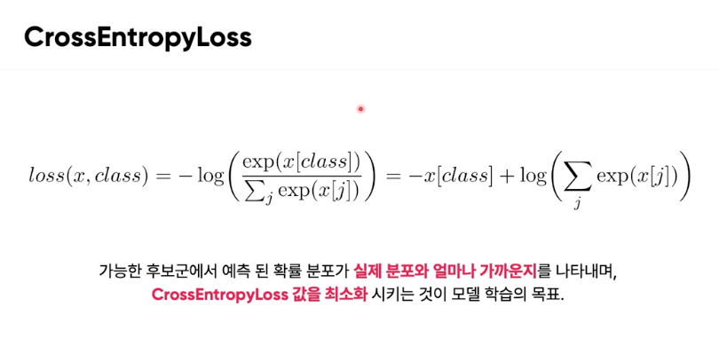

# 모델 학습과 서빙

#### CrossEntropyLoss 



CrossEntropyLoss는 기계 학습, 특히 분류 문제에서 널리 사용되는 손실 함수임. 

이 함수는 모델의 예측이 실제 레이블과 얼마나 잘 일치하는지를 측정한다. 높은 수준의 일치도를 가진 예측일수록 낮은 손실 값을 가지며, 그 반대의 경우 높은 손실 값을 가진다. 

- x는 모델이 각 클래스에 대해 계산한 로짓(즉, 신경망의 출력층에서의 원시 점수)임. 
- class는 실제 클래스의 인덱스를 나타냄. 
- exp(x[class])는 실제 클래스에 해당하는 로짓의 지수 값을 계산한다. 
- 시그마 exp(x[j]) 는 모든 클래스에 대한 로짓의 지수 값의 합을 계산한다. 이는 정규화 상수로 작용하여 각 클래스에 대한 예측 확률을 구한다. 

중요한 건 모델이 각 클래스에 대한 예측한 확률이 있을건데, 실제 정답 클래스의 확률 값이 높을수록 손실 함수의 값은 작아지고, 정답 클래스의 확률 값이 낮을수록 손실 함수의 값은 커지며, 정답이 아닌 클래스에 대한 예측 확률이 높다면 손실 함수 또한 값이 커진다라는 걸 알아야한다.  

***


#### Q) 정확한 클래스를 예측했을 때 손실 함수의 값은 작고, 잘못된 클래스를 예측했을 때 손실 함수의 값은 크다는 걸 알텐데 MNIST 기준으로는 틀리기만 하면은 손실 함수의 값은 같아지게 되는거야?

하지만 잘못된 클래스를 예측했을 경우 손실 함수의 값이 모두 같아지는 것은 아님. 손실 값은 잘못된 클래스에 할당된 확률의 크기에 따라 달라짐. 

모델이 잘못된 클래스에 더 높은 확률을 할당하면 할당할수록 손실은 커진다. 이는 예측된 확률 분포의 형태에 따라 달라질 수 있다. 

그러니까 다른 클래스로 잘못 예측하더라도 확신의 정도가 같다면 손실함수의 값은 같은거임. 
- 예시: 예를 들어, 실제 클래스가 0인데, 모델이 다음과 같이 예측했다고 가정
- 잘못된 예측 A: [0.1, 0.8, 0.1], 잘못된 예측 B: [0.1, 0.1, 0.8] 인 경우 손실 함수의 값은 같게된다. 

*** 

#### 다음 코드에 대해서 

```python
# 로짓 텐서 생성:
# 이 부분은 모델 출력, 즉 로짓 값들의 리스트를 포함하는 텐서를 생성합니다. 여기서 각 값은 10개의 다른 클래스에 대한 예측 점수를 나타낸다. 
loss = loss_function(torch.tensor([[
    0.8982,
    0.805,
    0.6393,
    0.9983,
    0.5731,
    0.0469,
    0.556,
    0.1476,
    1.2404,
    0.5544
]]), torch.LongTensor([3])) # 이 텐서는 실제 클래스 레이블을 나타내며, 여기서는 3이 실제 정답 클래스임을 나타낸다. 정답 클래스의 예측 확률이 높을수록 손실함수 값이 작아짐. 그래서 정답이 3일 때와 8일 때가 비교적 손실함수의 값이 낮아진다.   

# loss.item() 메소드는 손실 값을 파이썬의 표준 숫자 형태로 추출한다. 
loss.item()
```

## Gradient Descent 의 여러가지 종류 


- Adam 은 스텝 방향과 스텝 크기를 나름 최적화 한 방ㅇ법임 