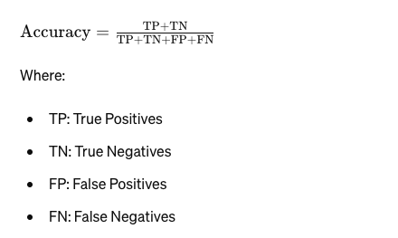
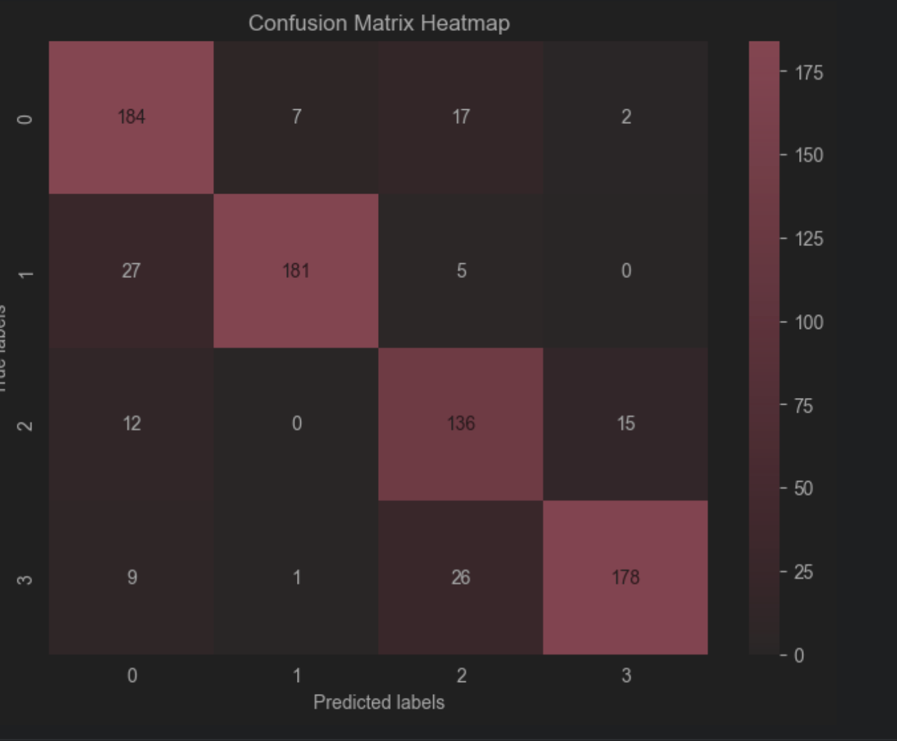

# 분류 모델 학습 및 평가 

## AG News 

AG News는 텍스트 분류 및 자연어 처리(NLP) 작업에 자주 사용되는 뉴스 기사 데이터셋임. 

이 데이터셋은 다양한 주제의 뉴스 기사를 포함하고 있으며, 머신러닝 및 딥러닝 모델의 훈련과 평가에 널리 사용된다. 

AG News 데이터셋 개요: 
- AG News 데이터셋은 총 120,000개의 뉴스 기사로 구성되어 있으며, 각 기사는 4개의 주제 중 하나로 분류되어 있음. 
- 각 주제는 다음과 같다: 
  - World (세계 뉴스)
  - Sports (스포츠)
  - Business (비즈니스)
  - Sci/Tech (과학 및 기술)

허깅 페이스에서 이 데이터를 다운 받을 수 있다: 
- https://huggingface.co/datasets/ag_news

```python
from datasets import load_dataset

# Load the AG News dataset
dataset = load_dataset('ag_news')
```


#### Q) 허깅 페이스는 뭐하는 곳임? 

NLP 와 ML 전문 기업임. 

여러가지 툴과 모델과 데이터 셋을 제공해준다. 

구체적으로 하는 일은 다음과 같음: 
- Transformers Library:
  - 구체적인 테스크 (e.g text classification, question answering, language translation, and text generation) 를 하는 사전 훈련된 트랜스포머 모델들을 지원한다.
  - 오픈 소스 철학을 따라서 이런 모델들을 지원해준다고 함. 
  - 그리고 모델의 추론 API 로 이용할 수 있게끔 팔기도 함. 
- Datasets Library: 
  - 다양한 자연어 처리 작업에 맞는 데이터 셋도 제공해준다. 
  - 한국어와 관련된 데이터셋도 제공해주긴 함. 
    - https://huggingface.co/collections/maywell/korean-datasets-ive-released-so-far-65614521738013bf3024d12c
- Model Hub:
  - 유저들끼리 모델을 공유할 수 있는 모델 허브를 제공해준다. 
- Inference API: 
  - 사전 훈련된 모델들을 API 로 이용할 수 있는 Inference API 서비스도 제공해준다. 
- Spaces
  - 머신러닝 앱 같은 것들을 만들고 공유할 수 있도록 해준다 


## 분류 모델 학습 및 평가 시나리오 

여기서는 BERT 모델을 다운로드 하고, 필요한 데이터 셋도 다운로드 한 이후에 모델을 학습하고 이를 여러 기준에 따라 평가해봄 

모델 평가: 
- Accuracy 평가:  
- Precision, Recall, F1 Score 평가:
- Confusion Matrix 평가: 
- ROC Curve 평가: 


Accuracy 평가: 
- 올바르게 예측한 수 / 전체 예측의 수 
- (TP + TN) / (TP + TN + FP + FN)
- 데이터 클래스가 불균형 한 경우 해당 지표는 큰 의미가 없을 수 있음. 예를 들면 희귀병 진단을 생각해보면 된다. 그냥 희귀병이 아니라고 판단만해도 99.9% 정확하게 나올거니까.
- 그래서 클래스가 균형을 이룰 때 주로 보면 좋은 지표이다. 



Precision: 
- TP / (TP + FP) 
- 거짓 양성 (= 맞다고 생각했는데 틀린 경우) 이 얼마나 일어나는지 알 수 있는 지표임.
- 그래서 거짓 양성의 비용이 얼마나 큰 지 보고 싶을 때 사용하는 지표임. 

Recall (Sensitivity)
- TP / (TP + FN)
- (TP + FN 은 실제 양성 샘플을 의미함)
- 거짓 음성 (= 아니라고 생각했는데 틀린 경우) 가 얼마나 일어났는지 알 수 있는 지표임.
- 그래서 거짓 음성이 얼마나 나타났는지 보고 싶을 때 사용하는 지표임. 

F1 Score: 
- 2 * (Precision x Recall) / (Precision + Recall)
- Precision 과 Recall 의 평균이라고 생각하면 됨. 

Confusion Matrix: 
- TP, FP, TN, FN 을 테이블로 나타낸 표임
- 디테일하게 각 값을 보고 싶을 때 사용한다  

ROC Curve: 
- 이 그래프의 면적을 통해서 모델의 성능을 나타낸다. 
- y 축은 TPR 로 TP / (TP + FN) 을 나타낸다. 즉 양성 샘플 중 양성을 얼마나 잘 예측하느냐, 양성 예측 능력을 믜미하고 
- X 축은 FPR 로 FP / (FP + TN) 을 나타낸다. 즉 음성 샘플 중 모델이 잘못 양성으로 예측한 걸 말한다. 
- AUC 가 높다는 건 TPR 을 충분히 높게 유지하면서도 FPR 을 낮게 유지하는 걸 말한다. 그래서 이 면적이 높다는 건 모델이 음성과 양성을 잘 예측한다는 걸말함. 특히 클래스 불균형이 있는 데이터셋에 유리하다. 

## 모델 평가 예제: 


```python
# PyTorch 라이브러리를 임포트한다. 
# PyTorch는 딥러닝 모델을 구축하고 훈련하는 데 사용되는 인기 있는 오픈 소스 머신러닝 라이브러리임. 주로 텐서 연산과 동적 계산 그래프를 제공한다. 
import torch

# PyTorch의 torch.nn.functional 모듈을 F라는 이름으로 임포트한다. 
# 이 모듈에는 자주 사용되는 다양한 손실 함수와 활성화 함수, 네트워크 레이어 등 딥러닝 모델을 구성하는 데 필요한 함수들이 포함되어 있다. 
import torch.nn.functional as F

# NumPy 라이브러리를 np라는 이름으로 임포트한다. 
# NumPy는 과학 계산을 위한 기본 패키지로, 고성능 다차원 배열 객체와 이들을 다루는 다양한 함수들을 제공한다. 
import numpy as np

# Matplotlib의 pyplot 모듈을 plt라는 이름으로 임포트한다. 
import matplotlib.pyplot as plt

# Seaborn 라이브러리를 sns라는 이름으로 임포트한다. 
# Seaborn은 Matplotlib 기반의 데이터 시각화 라이브러리로, 통계적 그래프를 그리는 데 유용한 고급 인터페이스와 스타일 옵션을 제공함. 
import seaborn as sns

# PyTorch의 DataLoader 클래스를 임포트한다.  
# DataLoader는 데이터셋을 쉽게 다루고, 배치로 나누어 모델에 전달하며, 셔플링과 병렬 데이터 로드를 지원함. 
from torch.utils.data import DataLoader

# Hugging Face의 transformers 라이브러리에서 BertTokenizer, BertForSequenceClassification, AdamW를 임포트함. 
# BertTokenizer: BERT 모델의 토크나이저로, 텍스트를 토큰으로 변환하는 역할을 한다. 
# BertForSequenceClassification: BERT 모델을 사용한 시퀀스 분류를 위한 모델 클래스임. 
# AdamW: 가중치 감쇠를 포함한 Adam 최적화 알고리즘임 
from transformers import BertTokenizer, BertForSequenceClassification, AdamW

# Hugging Face의 datasets 라이브러리에서 load_dataset 함수를 임포트한다.
# 이 함수는 다양한 데이터셋을 쉽게 로드할 수 있게 해줌 
from datasets import load_dataset

# Scikit-learn의 metrics 모듈에서 여러 평가 지표 함수를 임포트함. 
# auc: ROC 곡선의 아래 면적을 계산한다. 
# accuracy_score: 정확도를 계산한다. 
# confusion_matrix: 혼동 행렬을 만든다. 
# precision_recall_fscore_support: 정밀도, 재현율, F1 스코어, 지원을 계산한다. 
# roc_curve: ROC 곡선을 계산한다. 
from sklearn.metrics import auc, accuracy_score, confusion_matrix, precision_recall_fscore_support, roc_curve

# Scikit-learn의 preprocessing 모듈에서 label_binarize 함수를 임포트한다. 
# 이 함수는 다중 클래스 레이블을 이진화하여 이진 분류 문제로 변환할 때 사용된다. 
from sklearn.preprocessing import label_binarize

# tqdm 라이브러리를 임포트한다. 
# tqdm은 루프를 감싸서 진행 상황을 시각적으로 보여주는 진행 바(progress bar)를 쉽게 추가할 수 있게 해줌. 
from tqdm import tqdm

# typing 모듈에서 TypedDict를 임포트한다. 
# TypedDict는 사전의 키와 값의 타입을 명시할 수 있게 해주는 타입 힌팅 도구임. 
from typing import TypedDict
```

### 데이터 전처리

모델 평가를 학습하기 위한 코드이므로

전체 데이터(120,000) 중 극히 일부(1,200, 1%)만 사용.

```python
# Hugging Face datasets 라이브러리를 사용하여 "ag_news" 데이터셋을 로드한다. 
# AG News 데이터셋은 뉴스 기사 제목과 요약을 포함하며, 4개의 카테고리로 분류되어 있음. 
dataset = load_dataset("ag_news")

# Hugging Face의 transformers 라이브러리에서 사전 훈련된 "bert-base-uncased" BERT 모델의 토크나이저를 로드한다. 
# 이 토크나이저는 텍스트 데이터를 BERT 모델에 맞는 토큰 형식으로 변환한다. 
tokenizer = BertTokenizer.from_pretrained("bert-base-uncased")

# 사전 훈련된 "bert-base-uncased" BERT 모델을 로드하고, 시퀀스 분류를 위해 설정한다. 
# 여기서 num_labels=4는 AG News 데이터셋의 4가지 클래스(카테고리)를 나타낸다. 
# BertForSequenceClassification 는 transformers 라이브러리에서 제공하는 BERT 모델 중 하나임. 이건 시퀀스 분류를 위해 설계된 클래스이다.
# 이 클래스는 BERT 모델을 기반으로 하여 텍스트 시퀀스를 다양한 클래스(라벨) 중 하나로 분류하는 데 사용된다. 
# from_pretrained 메서드는 Hugging Face의 사전 훈련된 모델을 로드하는 데 사용된다.
# 이 메서드는 모델 아키텍처와 가중치를 로컬 또는 원격 저장소에서 불러와서 초기화한다. 
# 이건 사전 훈련된 모델은 대규모 데이터셋에서 학습된 모델로, 특정 작업을 위해 미세 조정(fine-tuning)될 수 있음.
# "bert-base-uncased": 는 로드할 사전 훈련된 BERT 모델의 이름임. 
# num_labels=4 는 분류할 클래스(라벨)의 수를 지정하는 매개변수임. 
model = BertForSequenceClassification.from_pretrained("bert-base-uncased", num_labels=4)

# TypedDict를 사용하여 DatasetItem이라는 클래스를 정의한다. 
# 이 클래스는 데이터셋 항목의 텍스트와 라벨을 포함한다. 
# 이는 데이터의 타입을 명시적으로 정의하여 타입 힌팅을 가능하게 한다. 
class DatasetItem(TypedDict):
    text: str
    label: str


# preprocess_data라는 함수를 정의한다.
# 이 함수는 DatasetItem 타입의 데이터를 입력받아, 토크나이저를 사용하여 텍스트를 토큰으로 변환한다. 
# 여기서 텍스트는 최대 길이로 잘리고(truncation=True), 최대 길이로 패딩(padding="max_length")된다.
# 결과는 파이토치 텐서 형식(return_tensors="pt")으로 반환된다. 
def preprocess_data(dataset_item: DatasetItem) -> dict[str, torch.Tensor]:
    return tokenizer(dataset_item["text"], truncation=True, padding="max_length", return_tensors="pt")


# 훈련 데이터셋에서 처음 1200개의 샘플을 선택하고, preprocess_data 함수를 사용하여 데이터를 전처리한다. 
# batched=True는 데이터를 배치 단위로 전처리함을 의미한다. 
train_dataset = dataset["train"].select(range(1200)).map(preprocess_data, batched=True)
test_dataset = dataset["test"].select(range(800)).map(preprocess_data, batched=True)

# 훈련 데이터셋의 포맷을 파이토치 텐서 형식으로 설정한다. 
# columns 매개변수는 모델 입력에 필요한 "input_ids", "attention_mask", "label" 열을 지정한다.
# set_format 함수는 Hugging Face datasets 라이브러리에서 데이터셋의 포맷을 지정하는 데 사용된다. 
# 이 함수는 데이터셋을 특정 형식으로 변환하여 후속 처리 및 모델에 적합한 형태로 만들 수 있다.
# "torch": 데이터셋의 포맷을 PyTorch 텐서 형식으로 설정한다. 이를 통해 데이터셋의 모든 샘플이 PyTorch 텐서로 변환된다. 
# columns=["input_ids", "attention_mask", "label"]: 모델 입력에 필요한 열(column)들을 지정한다. 지정된 열만 데이터셋에 포함되도록 필터링하여, 모델에 필요한 최소한의 정보만 포함한다.
# "input_ids": 토큰화된 입력 텍스트의 인덱스 배열이다. BERT 모델이 텍스트를 이해할 수 있도록 변환된 형태이다.
# "attention_mask": 입력 텍스트의 각 토큰이 실제 단어인지 패딩인지 나타내는 마스크이다. 1은 실제 단어를, 0은 패딩 토큰을 나타낸다. 
# "label": 각 입력 텍스트에 대한 정답 라벨이다. 분류 작업에서 텍스트가 속하는 클래스 정보를 담고 있다. 
train_dataset.set_format("torch", columns=["input_ids", "attention_mask", "label"])
test_dataset.set_format("torch", columns=["input_ids", "attention_mask", "label"])

# 훈련 데이터셋을 DataLoader로 감싼다. 
# batch_size=8로 배치 크기를 설정하고, shuffle=True로 데이터를 섞어서 모델에 전달한다. 
train_loader = DataLoader(train_dataset, batch_size=8, shuffle=True)
test_loader = DataLoader(test_dataset, batch_size=8, shuffle=False)

# 훈련 데이터셋을 Pandas 데이터프레임으로 변환한다.
# 이 변환은 데이터셋의 구조를 쉽게 확인하거나, 추가적인 분석 및 시각화를 위해 사용할 수 있다. 
train_dataset.to_pandas()

# 모델의 파라미터를 최적화하기 위해 AdamW 최적화 알고리즘을 설정한다. 
# 학습률(lr)은 5e-5로 설정됩니다. AdamW는 Adam의 변형으로, 가중치 감쇠(Weight Decay)를 포함하여 과적합을 방지한다. 
optimizer = AdamW(model.parameters(), lr=5e-5)

# 손실 함수로 교차 엔트로피 손실을 설정한다. 
# 이 손실 함수는 다중 클래스 분류 문제에서 널리 사용된다. 
criterion = torch.nn.CrossEntropyLoss()
```

### 모델 학습

```python
# 사용 가능한 디바이스(CPU 또는 GPU)를 선택한다.
# GPU가 사용 가능하면 cuda, 그렇지 않으면 cpu를 사용하여 연산 속도를 최적화한다. 
device = torch.device("cuda" if torch.cuda.is_available() else "cpu")

# 모델을 선택된 디바이스로 이동한다.
# 모델의 파라미터를 GPU 또는 CPU 메모리로 이동시켜 해당 디바이스에서 연산을 수행할 수 있게 한다. 
model.to(device)

# 학습 에폭의 수를 설정한다. 
# 모델 학습을 반복할 횟수를 정의하는 것. 
num_epochs = 3
for epoch in range(num_epochs):
    # 모델을 학습 모드로 설정한다. 
    # 학습 중에만 활성화되는 레이어나 동작을 활성화한다. 예를 들어, 드롭아웃(dropout)이나 배치 정규화(batch normalization) 같은 레이어가 있음. 
    model.train()
    
    # 총 손실 값을 초기화한다. 
    total_loss = 0
    
    # 학습 데이터 로더에서 배치를 가져오는 루프이다. 
    # 학습 데이터를 작은 배치 단위로 모델에 입력한다. 
    # tqdm은 진행률 표시줄을 제공하여 학습 진행 상황을 시각적으로 보여준다. 
    for batch in tqdm(train_loader, desc=f"Epoch {epoch + 1}"):
        # 배치의 입력 데이터를 선택된 디바이스로 이동시킨다. 
        # 모든 배치 데이터를 GPU 또는 CPU로 이동시켜 연산을 수행할 준비한다. 
        inputs = {key: batch[key].to(device) for key in batch}
        
        # 라벨 데이터를 입력 데이터에서 분리한다. 
        # 라벨은 예측 목표이므로 입력 데이터와 분리하여 따로 사용된다. 
        labels = inputs.pop("label")
        
        # 모델에 입력 데이터를 전달하여 출력을 계산한다. 
        # 모델이 예측을 수행하고, 해당 예측과 실제 라벨을 기반으로 손실을 계산한다. 
        outputs = model(**inputs, labels=labels)
        
        # 계산된 손실 값을 가져온다. 
        # 모델의 예측과 실제 라벨 간의 차이를 나타내는 손실 값을 사용하여 모델을 업데이트한다. 
        loss = outputs.loss
        
        # 배치 손실 값을 총 손실 값에 더한다. 
        # 에폭 동안 모든 배치의 손실 값을 누적하여 평균 손실을 계산한다. 
        total_loss += loss.item()

        # 이전 배치의 기울기를 초기화한다. 
        # 새로운 배치의 기울기를 계산하기 전에 기존 기울기를 초기화하여 기울기 누적을 방지한다. 
        optimizer.zero_grad()
        
        # 손실 값에 대한 기울기를 계산한다. 
        # 역전파를 통해 모델 파라미터에 대한 기울기를 계산하여 모델을 업데이트할 준비를 한다. 
        loss.backward()
        
        # 옵티마이저를 사용하여 모델 파라미터를 업데이트한다. 
        # 계산된 기울기를 사용하여 모델 파라미터를 조정한다. 
        optimizer.step()

    # 에폭 당 평균 손실 값을 계산한다. 
    # 총 손실 값을 배치 수로 나누어 에폭의 평균 손실 값을 얻는다. 
    average_loss = total_loss / len(train_loader)
    print(f"Epoch {epoch + 1}, Average Loss: {average_loss}")
```

### 모델 평가: STEP 1

Test dataset을 이용하여 가장 기초적인, accuracy 평가.

```python
# 모델을 평가 모드로 전환한다. 
# 드롭아웃(dropout)과 배치 정규화(batch normalization) 같은 레이어들이 평가 모드로 동작하도록 설정한다. 
# 이는 평가 시 불필요한 변동을 줄이고 일관된 결과를 얻기 위해 필요하다. 
model.eval()

# 정확하게 예측된 샘플의 수를 저장할 correct 변수와 전체 샘플 수를 저장할 total 변수를 초기화한다. 
# 정확도를 계산하기 위해 평가 중 올바르게 예측된 샘플의 수와 전체 샘플 수를 누적한다. 
correct = 0
total = 0

# 이 블록 내에서는 기울기 계산을 하지 않도록 설정한다. 
# 평가 단계에서는 역전파가 필요 없으므로, 메모리 사용량을 줄이고 연산 속도를 높이기 위해 기울기 계산을 비활성화한다. .
with torch.no_grad():
  
    # 테스트 데이터 로더에서 배치를 가져와 반복한다. tqdm을 사용하여 진행률 표시줄을 표시한다.
    # 테스트 데이터셋을 배치 단위로 모델에 입력하여 예측을 수행한다. 
    for batch in tqdm(test_loader, desc="Evaluating"):      
        # 배치의 입력 데이터를 선택된 디바이스로 이동시킨다. 
        # 모든 배치 데이터를 GPU 또는 CPU로 이동시켜 연산을 수행할 준비한다. 
        inputs = {key: batch[key].to(device) for key in batch}
        
        # 라벨 데이터를 입력 데이터에서 분리한다. 
        # 라벨은 예측 목표이므로 입력 데이터와 분리하여 따로 사용된다. 
        labels = inputs.pop("label")
        
        # 모델에 입력 데이터를 전달하여 출력을 계산한다. 
        # 모델이 예측을 수행하고, 해당 예측과 실제 라벨을 기반으로 손실을 계산한다. 
        outputs = model(**inputs, labels=labels)
        
        # 모델의 출력인 로짓(logits)을 가져온다. 
        # 로짓은 각 클래스에 대한 모델의 예측 확신도를 나타내는 값이다. 이 값을 통해 최종 예측 클래스를 결정한다. 
        logits = outputs.logits
        
        # 로짓에서 가장 큰 값을 가진 인덱스를 선택하여 예측된 클래스를 결정한다. 
        # 각 샘플에 대해 모델이 예측한 클래스를 얻는다. 
        predicted_labels = torch.argmax(logits, dim=1)
        
        # 예측된 라벨이 실제 라벨과 일치하는 경우를 세어 correct 변수에 더한다. 
        # 올바르게 예측된 샘플의 수를 누적한다. 
        correct += (predicted_labels == labels).sum().item()
        
        # 현재 배치의 전체 라벨 수를 total 변수에 더한다. 
        # 처리된 전체 샘플 수를 누적한다. 
        total += labels.size(0)

# 정확도를 계산한다. 
# 올바르게 예측된 샘플 수를 전체 샘플 수로 나누어 정확도를 계산한다. 
accuracy = correct / total

print("")
print(f"Test Accuracy: {accuracy * 100:.2f}%")
```

### 모델 평가: STEP 2

Confusion Matrix를 통한, 모델 성능 분석.

```python
# 평가 동안 예측된 라벨, 실제 라벨, 예측 확률을 저장할 리스트를 초기화한다. 
# 모델의 예측 결과를 저장하여 이후 분석에 사용됨. 
# all_predictions: 모델이 예측한 라벨을 저장한다. 
# all_labels: 실제 라벨을 저장한다. 
# all_probabilities: 각 클래스에 대한 예측 확률을 저장한다. 
all_predictions: list[int] = []
all_labels: list[int] = []
all_probabilities: list[float] = []


# 이 블록 내에서는 기울기 계산을 하지 않도록 설정한다. 
# 평가 단계에서는 역전파가 필요 없으므로, 메모리 사용량을 줄이고 연산 속도를 높이기 위해 기울기 계산을 비활성화한다. 
with torch.no_grad():
  
    # 테스트 데이터 로더에서 배치를 가져와 반복한다. 
    # 테스트 데이터셋을 배치 단위로 모델에 입력하여 예측을 수행한다. 
    for batch in test_loader:
        
        # 배치의 입력 데이터를 선택된 디바이스로 이동시킨다. 
        # 모든 배치 데이터를 GPU 또는 CPU로 이동시켜 연산을 수행할 준비한다. 
        inputs = {key: batch[key].to(device) for key in batch}
        
        # 라벨 데이터를 입력 데이터에서 분리한다. 
        # 라벨은 예측 목표이므로 입력 데이터와 분리하여 따로 사용된다. 
        labels = inputs.pop("label")
        
        # 모델에 입력 데이터를 전달하여 출력을 계산한다. 
        # 모델이 예측을 수행하고, 해당 예측 결과를 가져온다. 
        outputs = model(**inputs)
        
        # 모델의 출력인 로짓(logits)을 가져온다. 
        # 로짓은 각 클래스에 대한 모델의 예측 확신도를 나타내는 값이다. 이 값을 통해 최종 예측 클래스를 결정한다. 
        logits = outputs.logits
        
        # 로짓에서 가장 큰 값을 가진 인덱스를 선택하여 예측된 클래스를 결정한다. 
        # 각 샘플에 대해 모델이 예측한 클래스를 얻는다. 
        predicted_labels = torch.argmax(logits, dim=1)
        
        # 로짓 값을 소프트맥스 함수에 통과시켜 각 클래스에 대한 예측 확률을 계산한다. 
        # 모델이 각 클래스에 대해 얼마나 확신하는지를 확률 값으로 변환한다. 
        probabilities = F.softmax(logits, dim=1)

        # 예측된 라벨을 CPU로 이동시키고, 넘파이 배열로 변환하여 all_predictions 리스트에 추가한다. 
        # 모델이 예측한 모든 라벨을 리스트에 저장한다. 
        all_predictions.extend(predicted_labels.cpu().numpy())
        
        # 실제 라벨을 CPU로 이동시키고, 넘파이 배열로 변환하여 all_labels 리스트에 추가한다. 
        all_labels.extend(labels.cpu().numpy())
        
        # 예측 확률을 CPU로 이동시키고, 넘파이 배열로 변환하여 all_probabilities 리스트에 추가한다. 
        all_probabilities.extend(probabilities.cpu().numpy())
        
# 실제 라벨과 예측된 라벨을 사용하여 혼동 행렬(confusion matrix)을 계산한다. 
conf_matrix = confusion_matrix(all_labels, all_predictions)

# 새로운 그래프를 그리기 위한 Figure 객체를 생성하고 크기를 설정한다. 
# 그래프의 크기를 지정하여 시각화를 준비한다. 
plt.figure(figsize=(8, 6))

# 혼동 행렬을 히트맵(heatmap)으로 시각화한다. 
# annot=True는 각 셀에 숫자를 표시하고, fmt="g"는 셀에 표시될 숫자의 형식을 지정하며, cmap은 히트맵의 색상 팔레트를 설정한다. 
# 혼동 행렬을 시각적으로 표시하여 모델의 예측 성능을 쉽게 파악할 수 있게 한다. 
sns.heatmap(conf_matrix, annot=True, fmt="g", cmap=sns.light_palette("#fc1c49", as_cmap=True))

# x축이 예측된 라벨을 나타낸다는 것을 명확히 한다. 
plt.xlabel("Predicted labels")

# y축이 실제 라벨을 나타낸다는 것을 명확히 한다. 
plt.ylabel("True labels")

# 그래프가 혼동 행렬 히트맵을 나타낸다는 것을 명확히 한다. 
plt.title("Confusion Matrix Heatmap")

# 생성된 그래프를 화면에 표시한다. 
plt.show()
```



위 차트로 미루어보아 전반적인 분류 문제는 잘 예측하고 있으나 

Business(2) 케이스에서 Word(0)이나 Sci/Tech(3)로 오분류 하는 문제가 발생하는 양상을 보임.

### 모델 평가: STEP 3

Precision, Recall, F1 score 매트릭을 바탕으로 모델 평가.

```python
# Scikit-learn의 accuracy_score 함수를 사용하여 모델의 정확도를 계산한다. 
# 실제 라벨(all_labels)과 예측된 라벨(all_predictions) 간의 일치 비율을 계산하여 정확도를 평가함. 
accuracy = accuracy_score(all_labels, all_predictions)

# Scikit-learn의 precision_recall_fscore_support 함수를 사용하여 정밀도, 재현율, F1 스코어를 계산한다. 
# average="macro"를 사용하여 각 클래스의 지표를 계산한 후, 클래스별 가중치를 동일하게 반영한 평균 값을 반환한다.
# precision: 모델이 양성으로 예측한 샘플 중 실제 양성인 샘플의 비율 
# recall: 실제 양성 샘플 중 모델이 양성으로 정확하게 예측한 비율.
# f1: 정밀도와 재현율의 조화 평균.
precision, recall, f1, _ = precision_recall_fscore_support(all_labels, all_predictions, average="macro")

# 평가 지표와 해당 값을 저장하는 사전을 생성한다. 
# 평가 지표와 그 값을 손쉽게 시각화하기 위해 데이터 구조로 준비한다. 
# "Metrics": 평가 지표의 이름을 리스트로 저장 
# "Values": 각 평가 지표에 해당하는 값을 리스트로 저장. 
metrics_data = {
    "Metrics": ["Accuracy", "Precision", "Recall", "F1 Score"],
    "Values": [accuracy, precision, recall, f1]
}

# Seaborn의 테마를 설정한다. 
# 그래프의 스타일을 "whitegrid"로 설정하여 배경에 격자무늬를 추가하고, 시각적으로 깔끔하게 만든다. 
sns.set_theme(style="whitegrid")

# 새로운 그래프를 그리기 위한 Figure 객체를 생성하고 크기를 설정한다. 
# 그래프의 크기를 가로 10인치, 세로 6인치로 지정하여 시각화를 준비한다. 
plt.figure(figsize=(10, 6))

# Seaborn의 barplot 함수를 사용하여 막대 그래프를 생성한다. 
# 평가 지표와 그 값을 막대 그래프로 시각화하여 모델의 성능을 한눈에 파악할 수 있게 한다. 
# x="Metrics": x축에 평가 지표 이름을 사용.
# y="Values": y축에 각 지표의 값을 사용.
# data=metrics_data: 데이터 소스로 metrics_data 사전을 사용.
# palette: 막대의 색상을 지정.
ax = sns.barplot(x="Metrics", y="Values", data=metrics_data, palette=["#fc1c49", "#00a67d", "#ffa71b", "#6f42c1"])

# y축의 범위를 0.8에서 0.9로 설정한다. 
# y축의 범위를 제한하여 그래프가 더 집중되고 비교가 쉬워지도록 한다. 
ax.set_ylim(0.8, 0.9)

# 그래프의 제목을 설정한다. 
# 그래프가 모델 성능의 정확도, 정밀도, 재현율, F1 스코어를 나타낸다는 것을 명확히 한다. 
plt.title("Model Performance: Accuracy, Precision, Recall, F1 Score")

# 그래프를 표시한다.
plt.show()
```


### 모델 평가: STEP 4

Receiver Operating Characteristic(ROC) Curve를 이용하여 모델의 성능을 검증, 이 과정에서는 True Positive Rate(TPR) / False Positive Rate(FPR)을 기준으로 시각화.

각 Instance의 선분의 밑변의 넓이가 클 수록 좋음.

```python
# label_binarize 함수를 사용하여 다중 클래스 라벨을 이진화한다.
# ROC 곡선은 기본적으로 이진 분류(binary classification)에서 사용되기 때문에 다중 클래스 분류(multi-class classification)를 다루기 위해서는 각 클래스를 개별적으로 이진 분류 문제로 변환해야 한다. 
# 각 클래스 라벨을 0과 1로 이진화하여 ROC 곡선을 그리기 위한 형식으로 변환한다. 
# [0, 1, 2, 3] 클래스에 대해 각 클래스가 해당 클래스인지 여부를 나타내는 바이너리 벡터로 변환합니다. 예를 들어, 라벨이 2인 경우 [0, 0, 1, 0]으로 변환된다. 
# 예제: 주어진 다중 클래스 라벨: [0, 1, 2, 3]
# 변환된 이진 벡터: 
# 클래스 0: [1, 0, 0, 0]
# 클래스 1: [0, 1, 0, 0]
# 클래스 2: [0, 0, 1, 0]
# 클래스 3: [0, 0, 0, 1]
binary_labels = label_binarize(all_labels, classes=[0, 1, 2, 3])

# all_probabilities 리스트를 NumPy 배열로 변환한다.
# NumPy 배열로 변환하여 배열 연산을 쉽게 수행할 수 있게 한다. 
# 넘파이 배열은 동일한 데이터 타입을 사용하는 연속된 메모리 블록에 데이터를 저장하여 메모리 사용을 최적화한다.
# 넘파이 배열은 배열 연산을 위해 최적화된 C 언어로 구현되어 있어, 동일한 연산을 수행할 때 파이썬 리스트보다 훨씬 빠르다. 
all_probabilities = np.array(all_probabilities)

# 클래스의 수를 계산한다. 
# 이진화된 라벨의 열 수를 통해 클래스의 수를 얻는다. 이 예제에서는 4개의 클래스가 있다. 
n_classes = binary_labels.shape[1]

# False Positive Rate(FPR), True Positive Rate(TPR), ROC AUC 점수를 저장할 딕셔너리를 초기화한다. 
# 각 클래스에 대한 FPR, TPR, ROC AUC 값을 저장하기 위해 빈 딕셔너리를 생성한다. 
fpr: dict[int, float] = {}
tpr: dict[int, float] = {}
roc_auc: dict[int, float] = {}

# 각 클래스를 반복한다. 
# 각 클래스에 대해 ROC 곡선을 계산하고 시각화하기 위한 루프를 설정한다. 
for i in range(n_classes):
    # roc_curve 함수를 사용하여 해당 클래스의 FPR, TPR 값을 계산한다.
    # 이진화된 실제 라벨과 예측 확률을 사용하여 ROC 곡선을 그리기 위한 데이터 포인트를 얻는다.
    fpr[i], tpr[i], _ = roc_curve(binary_labels[:, i], all_probabilities[:, i])
    
    # auc 함수를 사용하여 ROC 곡선 아래의 면적(AUC)을 계산한다. 
    # 각 클래스에 대한 ROC AUC 점수를 계산하여 모델의 성능을 평가한다. 
    roc_auc[i] = auc(fpr[i], tpr[i])

# 새로운 그래프를 그리기 위한 Figure 객체를 생성하고 크기를 설정한다.     
plt.figure(figsize=(8, 6))

# 각  클래스의 ROC 곡선을 그리기 위한 색상을 지정한다. 
colors = ["#fc1c49", "#00a67d", "#ffa71b", "#6f42c1"]

# 클래스 인덱스와 색상을 동시에 반복한다. 
for i, color in zip(range(n_classes), colors):
    # plt.plot 함수를 사용하여 ROC 곡선을 그린다. 
    # 각 클래스의 FPR과 TPR을 플로팅하여 ROC 곡선을 시각화한다. lw는 선의 너비를, label은 범례에 표시될 텍스트를 지정한다. 
    plt.plot(fpr[i], tpr[i], color=color, lw=2,
             label=f"ROC curve of class {i} (area = {roc_auc[i]:.2f})")
    
    # plt.fill_between 함수를 사용하여 ROC 곡선 아래의 면적을 색칠한다.
    # ROC 곡선 아래의 면적을 색칠하여 AUC를 시각적으로 강조합니다. alpha는 투명도를 설정한다. 
    plt.fill_between(fpr[i], tpr[i], color=color, alpha=0.1)

# 대각선 기준선을 그린다. 
# 완전한 무작위 예측의 기준선으로서 y=x 대각선을 플로팅하여 ROC 곡선의 성능을 비교할 수 있게 한다. 
plt.plot([0, 1], [0, 1], "k--", lw=2)

plt.xlabel("False Positive Rate")
plt.ylabel("True Positive Rate")
plt.title("Receiver Operating Characteristic(ROC) for Multi-Class")

# 범례를 설정한다. 
# 범례를 그래프의 오른쪽 아래에 위치시켜 각 클래스의 ROC 곡선과 AUC 점수를 나타낸다. 
plt.legend(loc="lower right")
plt.show()
```